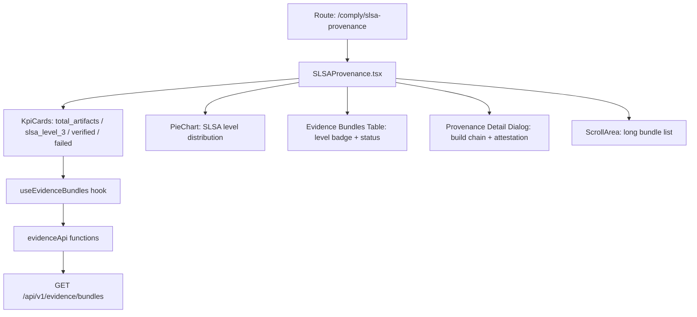

# PRD — Community 400: SLSA Provenance Dashboard (aldeci-ui-new)

## Master Goal Mapping
- **Platform Goal**: Supply chain security — SLSA level attestation, build provenance tracking, artifact integrity
- **Persona**: DevSecOps Engineer, Supply Chain Security Lead, Compliance Officer
- **ALDECI Pillar**: Supply Chain Security / SLSA Compliance
- **Backend**: Evidence bundle system, `suite-evidence-risk/`

## Architecture Diagram


## Code Proof
- **File**: `suite-ui/aldeci-ui-new/src/pages/comply/SLSAProvenance.tsx:1-80+`
- **SLSA_COLORS**: Record<number, string> — level 1/2/3/4 color mapping
- **Hooks**: `useEvidenceBundles` from `@/hooks/use-api`
- **API**: `evidenceApi` from `@/lib/api`
- **Charts**: PieChart, Pie, Cell, Tooltip, ResponsiveContainer, Legend from recharts
- **Icons**: GitBranch, Shield, CheckCircle, AlertTriangle, XCircle, Eye, Link2, Box, Layers, Clock, GitCommit, ArrowRight, ShieldCheck

## Inter-Dependencies
- **Backend**: Evidence chain engine (`evidence_chain_engine.py` — 30 tests, tamper-evident)
- **Hooks**: `use-api.ts` → `useEvidenceBundles`
- **API lib**: `@/lib/api` → `evidenceApi`
- **Related**: SBOM export, EvidenceVault, SOC2 evidence, ComplianceEvidence

## Data Flow
```
useEvidenceBundles → GET /api/v1/evidence/bundles →
PieChart shows SLSA level distribution →
Table lists bundles with level badges →
Click row → Dialog opens with provenance chain →
ScrollArea handles long attestation JSON
```

## Acceptance Criteria
- [ ] SLSA levels 1-4 with distinct colors in PieChart
- [ ] Table shows artifact name, SLSA level, status, build_id
- [ ] Detail dialog shows full build provenance chain
- [ ] Verified status = green ShieldCheck, failed = red XCircle
- [ ] toArray() prevents crash on non-array response
- [ ] PageSkeleton during loading, ErrorState on error

## Effort Estimate
**M** — 2.5 days (complete)

## Status
**DONE** — Production supply chain page
