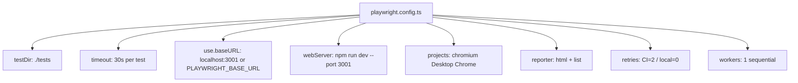

# PRD — Community 402: Playwright E2E Test Configuration (aldeci legacy)

## Master Goal Mapping
- **Platform Goal**: End-to-end test infrastructure for the legacy aldeci UI — smoke tests, CI configuration
- **Persona**: QA Engineers, DevOps CI/CD pipeline
- **ALDECI Pillar**: Quality Assurance / CI-CD

## Architecture Diagram


## Code Proof
- **File**: `suite-ui/aldeci/playwright.config.ts:1-30`
- **Base URL**: `process.env.PLAYWRIGHT_BASE_URL || 'http://localhost:3001'`
- **webServer**: `reuseExistingServer: true` — doesn't restart dev server if running
- **Screenshot**: `only-on-failure`
- **Trace**: `on-first-retry`

## Inter-Dependencies
- **Test files**: `suite-ui/aldeci/tests/smoke.spec.ts`
- **Dev server**: Vite dev server on port 3001
- **CI**: `forbidOnly: !!process.env.CI` prevents test.only in CI

## Data Flow
```
CI runs `npx playwright test` →
webServer starts Vite dev (port 3001) →
Chromium browser opens →
smoke.spec.ts navigates pages →
Screenshots on failure →
HTML report generated
```

## Acceptance Criteria
- [ ] CI mode: retries=2, forbids test.only
- [ ] Local mode: retries=0
- [ ] Reuses existing dev server
- [ ] Screenshots captured only on failure
- [ ] HTML + list reporters both active

## Effort Estimate
**XS** — 0.5 days (complete)

## Status
**DONE** — Stable test config
