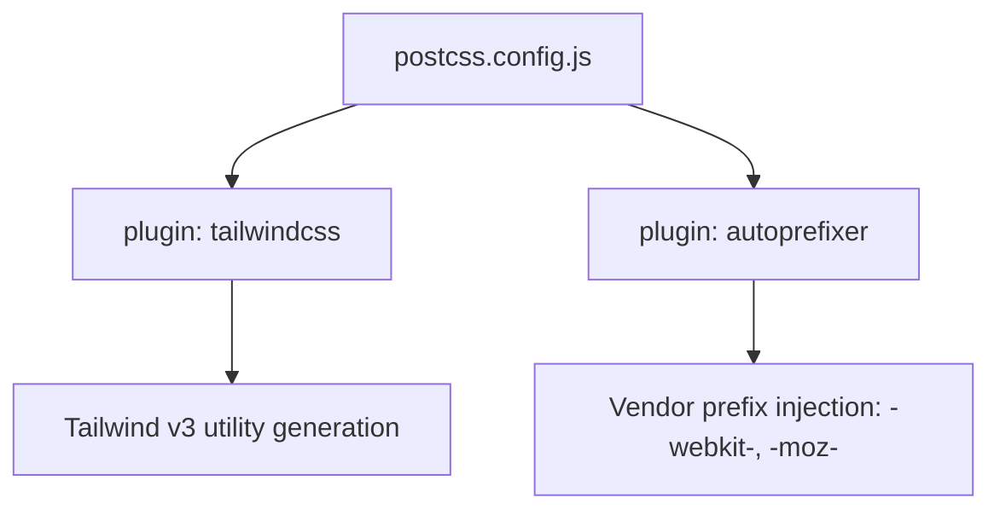

# PRD — Community 404: PostCSS Configuration (aldeci legacy)

## Master Goal Mapping
- **Platform Goal**: CSS processing pipeline for the legacy aldeci UI — Tailwind compilation and vendor prefixing
- **Persona**: Frontend Engineers
- **ALDECI Pillar**: Build System (Legacy)

## Architecture Diagram

## Code Proof
- **File**: `suite-ui/aldeci/postcss.config.js:1-6`
- **Format**: ES module (`export default { plugins: { tailwindcss: {}, autoprefixer: {} } }`)
- **Plugins**: `tailwindcss` (reads tailwind.config.js), `autoprefixer` (browser compat)

## Inter-Dependencies
- **Upstream**: Vite CSS processing pipeline
- **Downstream**: All component CSS in legacy aldeci
- **Mirror**: `suite-ui/aldeci-ui-new/` uses Tailwind v4 (CSS-first, different pipeline)

## Acceptance Criteria
- [ ] Tailwind utilities generated from config
- [ ] Autoprefixer adds browser vendor prefixes
- [ ] ES module format compatible with Vite

## Effort Estimate
**XS** — 0.1 days (complete, frozen)

## Status
**DONE** — Stable, frozen legacy PostCSS config
