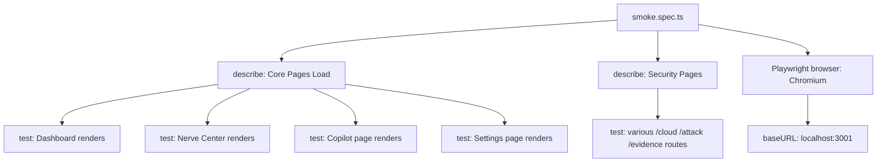

# PRD — Community 405: Playwright Smoke Tests (aldeci legacy)

## Master Goal Mapping
- **Platform Goal**: E2E smoke test coverage for critical legacy aldeci pages — CI gate preventing broken deployments
- **Persona**: QA Engineers, DevOps CI pipeline
- **ALDECI Pillar**: Quality Assurance / CI-CD

## Architecture Diagram


## Code Proof
- **File**: `suite-ui/aldeci/tests/smoke.spec.ts:1-60+`
- **Pattern**: `page.goto(route)` → `expect(page.locator('body')).toBeVisible()` → check first card/heading
- **Selectors**: `[class*="card"]`, `[class*="Card"]`, `main`, `h1`, `h2` — flexible class matching
- **Timeout**: 10s per element visibility check
- **Routes tested**: /, /nerve-center, /copilot, /settings, + security routes

## Inter-Dependencies
- **Config**: `playwright.config.ts` — baseURL, retries, webServer
- **App**: `suite-ui/aldeci/src/App.tsx` — route definitions
- **CI**: Runs in GitHub Actions via `npx playwright test`

## Data Flow
```
CI → playwright test → Chromium launches → navigate to each route →
check body + first meaningful element visible →
pass = page loaded; fail = screenshot captured
```

## Acceptance Criteria
- [ ] Dashboard route (/) renders card or main element
- [ ] Nerve Center route renders in 10s
- [ ] Copilot route renders textarea or input
- [ ] Settings route renders
- [ ] All security sub-routes load without JS errors
- [ ] CI: retries=2 on flaky tests

## Effort Estimate
**S** — 1 day (complete)

## Status
**DONE** — Active CI smoke tests
