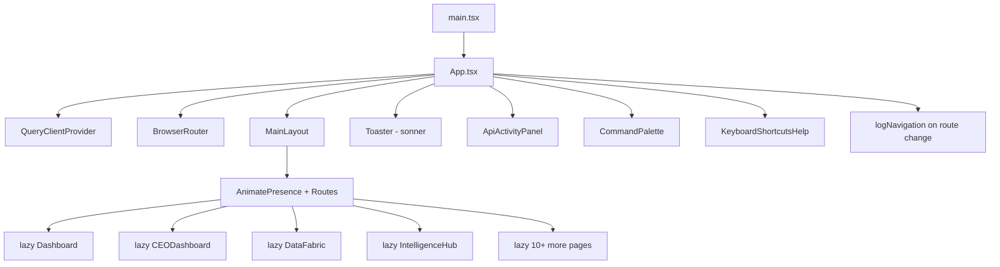

# PRD — Community 406: App Entry / Router (aldeci legacy)

## Master Goal Mapping
- **Platform Goal**: Root React application — lazy-loaded routes, QueryClient, error boundaries, keyboard shortcuts, command palette
- **Persona**: All users — this IS the application shell
- **ALDECI Pillar**: Frontend Application Shell (Legacy)

## Architecture Diagram


## Code Proof
- **File**: `suite-ui/aldeci/src/App.tsx:1-50+`
- **Lazy imports**: Dashboard, CEODashboard, DataFabric, IntelligenceHub, DecisionEngine, AttackLab, RemediationCenter, EvidenceVault, Settings, Copilot
- **Pattern**: `React.lazy(() => import('./pages/X'))` + `<Suspense>`
- **Navigation logging**: `logNavigation` + `logClick` from `./lib/api`
- **State**: `useUIStore` from `./stores`

## Inter-Dependencies
- **Store**: `./stores/index.ts` — UIStore (sidebar, theme, copilot)
- **Layout**: `./layouts/MainLayout`
- **Logging**: `./lib/api` — logNavigation, logClick
- **QueryClient**: `@tanstack/react-query`

## Data Flow
```
main.tsx → ReactDOM.createRoot → App renders →
QueryClientProvider wraps all → BrowserRouter parses URL →
AnimatePresence + Routes: lazy page loaded in Suspense →
useLocation change → logNavigation fires
```

## Acceptance Criteria
- [ ] All routes lazy-loaded with Suspense fallback
- [ ] QueryClient provided to all components
- [ ] Navigation events logged to API
- [ ] Error boundary wraps routes
- [ ] Keyboard shortcuts overlay (?) toggleable
- [ ] Command palette accessible globally

## Effort Estimate
**M** — 2 days (complete, frozen)

## Status
**DONE** — Stable legacy app shell
