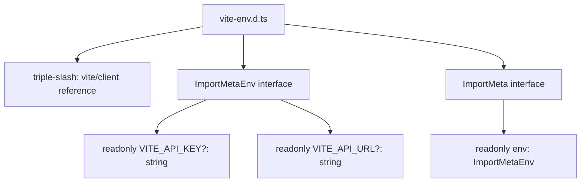

# PRD — Community 408: Vite Environment Types (aldeci legacy)

## Master Goal Mapping
- **Platform Goal**: TypeScript type declarations for Vite environment variables — prevents `import.meta.env.VITE_*` type errors
- **Persona**: Frontend Engineers (TypeScript compiler)
- **ALDECI Pillar**: Type Safety / Build System (Legacy)

## Architecture Diagram

## Code Proof
- **File**: `suite-ui/aldeci/src/vite-env.d.ts:1-10`
- **`/// <reference types="vite/client" />`**: injects all Vite built-in env types
- **Custom vars**: VITE_API_KEY, VITE_API_URL (optional strings)
- **Pattern**: `ImportMetaEnv` augmentation adds project-specific vars

## Inter-Dependencies
- **Upstream**: `vite/client` types package
- **Downstream**: Any file using `import.meta.env.VITE_*`
- **Mirror**: `suite-ui/aldeci-ui-new/` has identical pattern

## Acceptance Criteria
- [ ] `import.meta.env.VITE_API_KEY` type-safe (string | undefined)
- [ ] `import.meta.env.VITE_API_URL` type-safe (string | undefined)
- [ ] No TypeScript errors on `import.meta.env` access
- [ ] Triple-slash reference provides all built-in Vite types (MODE, DEV, PROD, etc.)

## Effort Estimate
**XS** — 0.1 days (complete, frozen)

## Status
**DONE** — Stable type declaration
