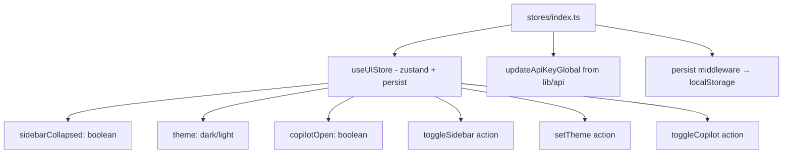

# PRD — Community 409: Zustand State Stores (aldeci legacy)

## Master Goal Mapping
- **Platform Goal**: Client-side state management — UI preferences (sidebar, theme, copilot) and API key persistence
- **Persona**: All users — sidebar collapsed state, dark/light theme persist across sessions
- **ALDECI Pillar**: Frontend State Management (Legacy)

## Architecture Diagram


## Code Proof
- **File**: `suite-ui/aldeci/src/stores/index.ts:1-40+`
- **Library**: `zustand` with `persist` middleware
- **Persistence**: `localStorage` via zustand persist
- **UIStore interface**: `sidebarCollapsed`, `theme`, `copilotOpen`, + action methods
- **API integration**: `updateApiKeyGlobal` wired to API key changes

## Inter-Dependencies
- **Upstream**: `zustand`, `zustand/middleware` (persist)
- **Downstream**: `App.tsx` (useUIStore for sidebar state), MainLayout, Copilot toggle
- **API**: `../lib/api` — `updateApiKeyGlobal` for runtime API key changes

## Data Flow
```
Component calls useUIStore(state => state.sidebarCollapsed) →
toggleSidebar() → set({ sidebarCollapsed: !prev }) →
persist middleware writes to localStorage →
Next session restores state automatically
```

## Acceptance Criteria
- [ ] Sidebar state persists across page refreshes
- [ ] Theme preference persists
- [ ] Copilot open state togglable
- [ ] updateApiKeyGlobal fires when API key changes in store
- [ ] TypeScript interfaces fully typed

## Effort Estimate
**S** — 1 day (complete, frozen)

## Status
**DONE** — Stable state management
