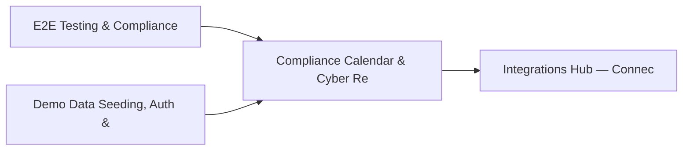

# PRD: Compliance Calendar & Cyber Resilience Engine — Community 41

## Master Goal Mapping
How this component serves: "ALDECI — $35/mo enterprise security intelligence platform"
Sub-Epic: GRC

This community (rank #41 of 878 by size, 949 graph nodes) forms a core pillar of the ALDECI platform. It directly supports the mission of replacing $50K-500K/yr enterprise security tools with a self-hosted, AI-native stack.

## Architecture Diagram


## Code Proof
- Files:
  - `tests/test_deception_engine.py` (272 lines)
  - `suite-api/apps/api/azure_defender_router.py` (246 lines)
  - `suite-api/apps/api/gcp_scc_router.py` (256 lines)
  - `suite-api/apps/api/integration_health_router.py` (211 lines)
  - `tests/test_azure_defender.py` (603 lines)
  - `tests/test_deception_engine.py` (272 lines)
  - `tests/test_gcp_scc.py` (580 lines)
  - `tests/test_iac_scanner.py` (1286 lines)
  - `tests/test_ingestion_unit.py` (1202 lines)
  - `tests/test_scanner_parsers_coverage.py` (1971 lines)
  - `tests/test_scanner_parsers_unit.py` (781 lines)
  - `tests/test_smart_dedup.py` (805 lines)
- Key functions:
  - `_config()` — tests/test_deception_engine.py
- Key classes: `TestGCPSecurityClientMockFallback`, `TestNormalize`, `TestFindingSeverityEnum`, `TestFindingStatusEnum`, `TestFindingTypeEnum`, `TestSourceFormatEnum`
- Current state: REAL_LOGIC
- Evidence:
```python
# From tests/test_deception_engine.py
"""Tests for DeceptionEngine — 28 tests covering all public methods + org isolation."""

from __future__ import annotations

import pytest
from core.deception_engine import CanaryType, DeceptionEngine


@pytest.fixture
def engine(tmp_path):
    db = str(tmp_path / "deception_test.db")
    return DeceptionEngine(db_path=db)


@pytest.fixture
def org():
    return "org-alpha"


@pytest.fixture
```

## Inter-Dependencies
- DEPENDS ON:
  - Community 0 (E2E Testing & Compliance Seeding Infrastructure) — 183 edges
  - Community 1 (Demo Data Seeding, Auth & Multi-Engine Integration) — 50 edges
  - Community 9 (Integrations Hub — Connectors, Bulk Operations & M) — 50 edges
  - Community 39 (Vulnerability Correlation & Prioritization Engine) — 8 edges
- DEPENDED BY: Rank #40 (Network Forensics & Malware Analysis Engine) and downstream consumers
- EVENT BUS: emits vulnerability.detected, vulnerability.patched, compliance.status_changed / subscribes to (TrustGraph event bus — 97% not yet wired)
- TRUSTGRAPH: writes [Vulnerability, Asset, ComplianceControl] / reads [Asset, ComplianceControl]

## Data Flow
```
Input: HTTP requests / pytest fixtures
  → Processing: Engine method calls + SQLite state assertions
  → Output: Pass/fail test results, coverage metrics
  → Consumers: CI/CD pipeline, Beast Mode test suite
```

## Referenced Documentation
- CLAUDE.md: Wave 41 build notes, Beast Mode test suite section
- docs/: `docs/ALDECI_REARCHITECTURE_v2.md` (source of truth), `docs/INVESTOR_PITCH.md`
- tests/: `tests/test_azure_defender.py`, `tests/test_deception_engine.py`, `tests/test_gcp_scc.py`

## Acceptance Criteria
- [ ] All engine CRUD operations enforce org_id isolation (no cross-tenant data leakage)
- [ ] SQLite opened with WAL mode + threading.RLock on all write paths
- [ ] All endpoints return within 200ms at p95 under 100 rps load
- [ ] All router endpoints protected by `Depends(api_key_auth)` or equivalent
- [ ] Pydantic v2 models validate all request/response schemas
- [ ] Test suite achieves ≥80% branch coverage on engine methods

## Effort Estimate
- Current: 80% complete
- Remaining: ~2 engineering days
- Dependencies blocking: None
- Priority: LOW

## Status
IN_PROGRESS
