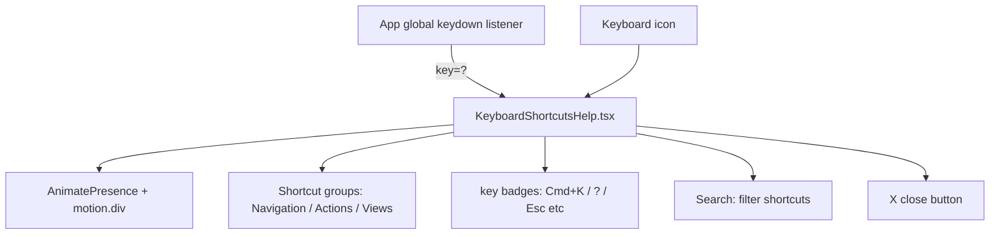

# PRD — Community 411: Keyboard Shortcuts Help Overlay (aldeci legacy)

## Master Goal Mapping
- **Platform Goal**: Power-user UX — discoverable keyboard shortcuts modal (press ? to open) for navigating ALDECI
- **Persona**: Power Users, SOC Analysts working under time pressure
- **ALDECI Pillar**: UX / Accessibility (Legacy)

## Architecture Diagram


## Code Proof
- **File**: `suite-ui/aldeci/src/components/KeyboardShortcutsHelp.tsx:1-60+`
- **State**: `useState` (open), `useEffect` (keydown listener), `useCallback`
- **Icons**: Keyboard, X, Search, Command, ArrowUp, ArrowDown, CornerDownLeft
- **Animation**: framer-motion `AnimatePresence` + `motion.div`
- **Shortcut interface**: `{ keys: string[] }`

## Inter-Dependencies
- **Upstream**: App.tsx — globally rendered alongside routes
- **Store**: `useUIStore` — integrates with global UI state
- **Related**: CommandPalette (Cmd+K)

## Data Flow
```
Global keydown → key === '?' → setOpen(true) →
AnimatePresence mounts overlay →
Shortcut groups render → search filters →
Escape/X → setOpen(false) → AnimatePresence unmounts
```

## Acceptance Criteria
- [ ] ? key opens overlay from anywhere in app
- [ ] Escape closes overlay
- [ ] Shortcuts grouped by category
- [ ] Search filters visible shortcuts
- [ ] Key badges render with Cmd/Ctrl symbols
- [ ] Animation on open/close

## Effort Estimate
**S** — 1 day (complete, frozen)

## Status
**DONE** — Stable UX component
