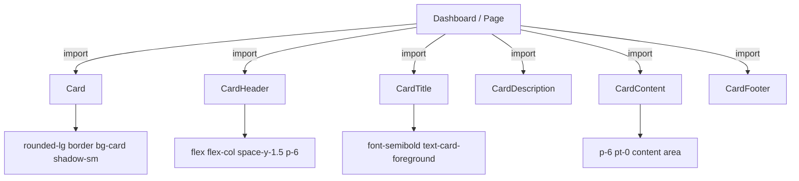

# PRD — Community 413: Card UI Primitive (aldeci legacy)

## Master Goal Mapping
- **Platform Goal**: Primary content container for all metric panels, finding cards, and dashboard widgets in legacy UI
- **Persona**: All users — foundational layout primitive
- **ALDECI Pillar**: UI Foundation (Legacy)

## Architecture Diagram

## Code Proof
- **File**: `suite-ui/aldeci/src/components/ui/card.tsx`
- **Exports**: `Card`, `CardHeader`, `CardTitle`, `CardDescription`, `CardContent`, `CardFooter`
- **Base card**: `rounded-lg border bg-card text-card-foreground shadow-sm`
- **Design token**: `bg-card` CSS custom property

## Inter-Dependencies
- **Upstream**: `@/lib/utils`
- **Downstream**: Every legacy page — Dashboard, NerveCenter, IntelligenceHub, AttackPaths, etc.

## Acceptance Criteria
- [ ] `bg-card` token applies dark/light mode correctly
- [ ] `shadow-sm` provides subtle elevation
- [ ] CardHeader/Content/Footer compose cleanly
- [ ] CardTitle renders as `h3` with correct weight

## Effort Estimate
**XS** — 0.5 days (complete, frozen)

## Status
**DONE** — Stable foundational primitive (legacy)
