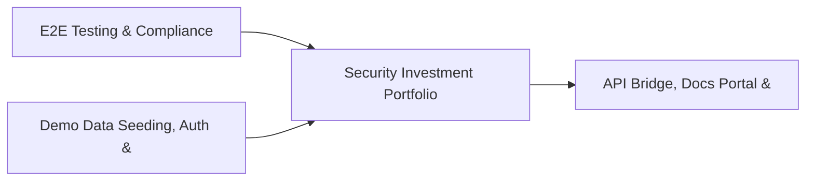

# PRD: Security Investment Portfolio & Budget Engine — Community 42

## Master Goal Mapping
How this component serves: "ALDECI — $35/mo enterprise security intelligence platform"
Sub-Epic: Executive

This community (rank #42 of 878 by size, 942 graph nodes) forms a core pillar of the ALDECI platform. It directly supports the mission of replacing $50K-500K/yr enterprise security tools with a self-hosted, AI-native stack.

## Architecture Diagram


## Code Proof
- Files:
  - `suite-api/apps/api/regulatory_tracker_engine_router.py` (224 lines)
  - `suite-core/core/ai_powered_soc_engine.py` (548 lines)
  - `suite-core/core/cloud_cost_optimization_engine.py` (542 lines)
  - `suite-core/core/data_privacy_engine.py` (348 lines)
  - `suite-core/core/gdpr_compliance_engine.py` (347 lines)
  - `suite-core/core/privacy_gdpr_engine.py` (707 lines)
  - `suite-core/core/security_tool_inventory_engine.py` (420 lines)
  - `suite-core/core/vulnerability_age_engine.py` (449 lines)
  - `suite-api/apps/api/ai_powered_soc_router.py` (256 lines)
  - `suite-api/apps/api/attack_surface_monitor_router.py` (227 lines)
  - `suite-api/apps/api/cloud_cost_optimization_router.py` (208 lines)
  - `suite-api/apps/api/data_privacy_router.py` (196 lines)
- Key functions:
  - `tmp_engine()` — suite-api/apps/api/regulatory_tracker_engine_router.py
  - `org()` — suite-api/apps/api/regulatory_tracker_engine_router.py
  - `org2()` — suite-api/apps/api/regulatory_tracker_engine_router.py
  - `test_update_request_status_not_found()` — suite-api/apps/api/regulatory_tracker_engine_router.py
  - `_pkg_data()` — suite-api/apps/api/regulatory_tracker_engine_router.py
  - `_register()` — suite-api/apps/api/regulatory_tracker_engine_router.py
  - `_detect()` — suite-api/apps/api/regulatory_tracker_engine_router.py
  - `test_register_package_returns_record()` — suite-api/apps/api/regulatory_tracker_engine_router.py
- Key classes: `TestDSRCreate`, `TestDSRDueDates`, `TestDSRListAndFilter`, `TestDSRFulfill`, `TestConsentRecord`, `TestConsentList`
- Current state: REAL_LOGIC
- Evidence:
```python
# From suite-api/apps/api/regulatory_tracker_engine_router.py
"""
Regulatory Change Tracker Engine API router.

Endpoints for tracking regulatory changes, compliance obligations, and assessments.

Prefix: /api/v1/regulatory-tracker
"""
from __future__ import annotations

import logging
import os
from typing import Any, Dict, List, Optional

from fastapi import APIRouter, Depends, HTTPException, Query
from pydantic import BaseModel, Field

logger = logging.getLogger(__name__)

router = APIRouter(prefix="/api/v1/regulatory-tracker", tags=["regulatory-tracker"])
```

## Inter-Dependencies
- DEPENDS ON:
  - Community 0 (E2E Testing & Compliance Seeding Infrastructure) — 165 edges
  - Community 1 (Demo Data Seeding, Auth & Multi-Engine Integration) — 14 edges
  - Community 5 (API Bridge, Docs Portal & Cross-Dashboard Infrastr) — 13 edges
  - Community 12 (Rate Limiting, Token Bucket & Middleware Framework) — 11 edges
- DEPENDED BY: Rank #41 (Compliance Calendar & Cyber Resilience Engine) and downstream consumers
- EVENT BUS: emits incident.opened, incident.closed / subscribes to (TrustGraph event bus — 97% not yet wired)
- TRUSTGRAPH: writes [Vulnerability, Incident, Identity] / reads [Identity, ComplianceControl]

## Data Flow
```
Input: HTTP requests / pytest fixtures
  → Processing: Engine method calls + SQLite state assertions
  → Output: Pass/fail test results, coverage metrics
  → Consumers: CI/CD pipeline, Beast Mode test suite
```

## Referenced Documentation
- CLAUDE.md: Wave 41 build notes, Beast Mode test suite section
- docs/: `docs/ALDECI_REARCHITECTURE_v2.md` (source of truth), `docs/INVESTOR_PITCH.md`
- tests/: `tests/test_ai_governance_engine.py`, `tests/test_ai_powered_soc_engine.py`, `tests/test_attack_surface_monitor.py`

## Acceptance Criteria
- [ ] All engine CRUD operations enforce org_id isolation (no cross-tenant data leakage)
- [ ] SQLite opened with WAL mode + threading.RLock on all write paths
- [ ] All endpoints return within 200ms at p95 under 100 rps load
- [ ] All router endpoints protected by `Depends(api_key_auth)` or equivalent
- [ ] Pydantic v2 models validate all request/response schemas
- [ ] Test suite achieves ≥80% branch coverage on engine methods

## Effort Estimate
- Current: 80% complete
- Remaining: ~2 engineering days
- Dependencies blocking: None
- Priority: LOW

## Status
IN_PROGRESS
