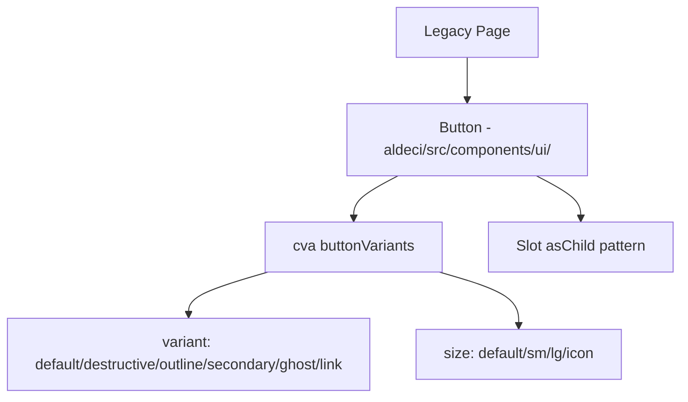

# PRD — Community 420: Button UI Primitive (aldeci legacy)

## Master Goal Mapping
- **Platform Goal**: Primary interactive button for all legacy aldeci pages
- **Persona**: All users
- **ALDECI Pillar**: UI Foundation (Legacy)
- **Note**: Legacy version in `suite-ui/aldeci/` — parallel to C368 (aldeci-ui-new)

## Architecture Diagram

## Code Proof
- **File**: `suite-ui/aldeci/src/components/ui/button.tsx`
- **Same cva structure** as C368 but legacy path
- **Consumers**: Every legacy page — AttackPaths run button, Marketplace install, Remediation apply

## Inter-Dependencies
- **Upstream**: `@radix-ui/react-slot`, `class-variance-authority`, `@/lib/utils`
- **Downstream**: Every legacy page CTA

## Acceptance Criteria
- [ ] Same 6 variants and 4 sizes as C368
- [ ] asChild works for anchor/link rendering
- [ ] Disabled state correct

## Effort Estimate
**XS** — 0.5 days (complete, frozen)

## Status
**DONE** — Frozen legacy primitive (do not modify)
