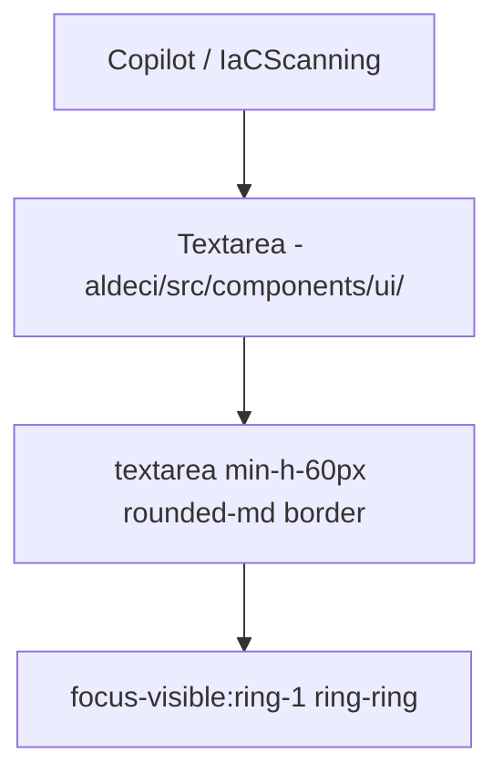

# PRD — Community 422: Textarea UI Primitive (aldeci legacy)

## Master Goal Mapping
- **Platform Goal**: Multi-line text input for legacy aldeci forms (Copilot input, IaC code editor)
- **Persona**: Security Engineers, Analysts using Copilot
- **ALDECI Pillar**: UI Foundation (Legacy)
- **Note**: Legacy parallel to C373 (aldeci-ui-new)

## Architecture Diagram

## Code Proof
- **File**: `suite-ui/aldeci/src/components/ui/textarea.tsx`
- **Consumers**: Copilot chat input (main use case), IaCScanning code paste area

## Inter-Dependencies
- **Upstream**: `@/lib/utils`
- **Downstream**: Copilot page (primary), IaCScanning

## Acceptance Criteria
- [ ] min-h-[60px] enforced
- [ ] Focus ring matches design tokens
- [ ] Auto-resizes with content

## Effort Estimate
**XS** — 0.1 days (complete, frozen)

## Status
**DONE** — Frozen legacy primitive
