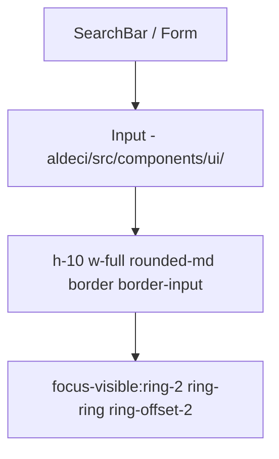

# PRD — Community 423: Input UI Primitive (aldeci legacy)

## Master Goal Mapping
- **Platform Goal**: Text input for legacy aldeci forms — search, API key, filter fields
- **Persona**: All users
- **ALDECI Pillar**: UI Foundation (Legacy)
- **Note**: Legacy parallel to C374 (aldeci-ui-new)

## Architecture Diagram

## Code Proof
- **File**: `suite-ui/aldeci/src/components/ui/input.tsx`
- **Height**: h-10 (legacy uses 40px vs 36px in new UI)
- **Consumers**: AuditLogs search, Marketplace search, IaCScanning repo URL input

## Inter-Dependencies
- **Upstream**: `@/lib/utils`
- **Downstream**: AuditLogs, Marketplace, ScannerDashboard, Reachability

## Acceptance Criteria
- [ ] h-10 height
- [ ] ring-2 focus ring (vs ring-1 in new UI — legacy difference)
- [ ] Disabled state correct

## Effort Estimate
**XS** — 0.1 days (complete, frozen)

## Status
**DONE** — Frozen legacy primitive
