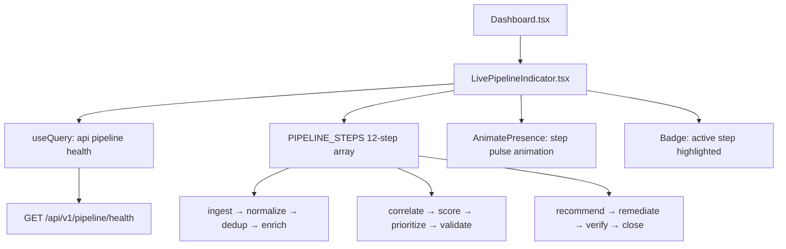

# PRD — Community 425: Live Pipeline Indicator Component (aldeci legacy)

## Master Goal Mapping
- **Platform Goal**: Real-time CTEM 12-step pipeline visualization on the dashboard — shows data flowing through the brain pipeline
- **Persona**: SOC Analyst, Security Engineer — situational awareness of pipeline health
- **ALDECI Pillar**: CTEM Pipeline / Real-time Monitoring (Legacy)

## Architecture Diagram


## Code Proof
- **File**: `suite-ui/aldeci/src/components/dashboard/LivePipelineIndicator.tsx:1-60+`
- **PIPELINE_STEPS**: 12 steps with id, label, icon, color
- **Icons per step**: Zap(ingest), Filter(normalize), GitMerge(dedup), Brain(enrich), Activity(correlate), Bug, Lock, FileCheck, Target, TrendingDown + more
- **Animation**: `useEffect` + `useState` for pulsing active step
- **API**: `api` from `../../lib/api`

## Inter-Dependencies
- **Backend**: `brain_pipeline.py` — core CTEM pipeline engine
- **API**: `/api/v1/pipeline/health`
- **Animation**: framer-motion AnimatePresence
- **Parent**: Dashboard.tsx

## Data Flow
```
useQuery pipeline/health → active_step identified →
AnimatePresence cycles through steps →
Current step Badge glows → throughput metric displayed →
Error: shows last known state
```

## Acceptance Criteria
- [ ] 12 pipeline steps displayed in order
- [ ] Active step highlighted with animation
- [ ] Each step has correct icon and color
- [ ] Live updates via useQuery refetch interval
- [ ] Pipeline health percentage shown
- [ ] AnimatePresence transitions between active steps

## Effort Estimate
**M** — 2 days (complete, frozen)

## Status
**DONE** — Frozen legacy real-time component
