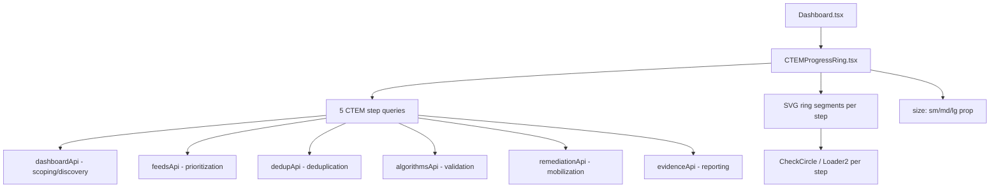

# PRD — Community 426: CTEM Progress Ring Component (aldeci legacy)

## Master Goal Mapping
- **Platform Goal**: SVG ring chart showing CTEM (Continuous Threat Exposure Management) stage completion across 5 CTEM phases
- **Persona**: CISO, SOC Manager — strategic CTEM program progress at a glance
- **ALDECI Pillar**: CTEM Pipeline / Executive Dashboard (Legacy)

## Architecture Diagram


## Code Proof
- **File**: `suite-ui/aldeci/src/components/dashboard/CTEMProgressRing.tsx:1-60+`
- **CTEMStep interface**: `{ id, name, suite, progress, status: 'complete'|'in-progress'|'pending', description }`
- **Size prop**: sm/md/lg → SVG dimensions scale
- **API queries**: 6 separate useQuery calls (dashboardApi, feedsApi, dedupApi, algorithmsApi, remediationApi, evidenceApi)
- **Icons**: CheckCircle (complete), Loader2 (in-progress, animated spin)

## Inter-Dependencies
- **Backend APIs**: dashboard, feeds, dedup, algorithms, remediation, evidence endpoints
- **Parent**: Dashboard.tsx — prominently placed
- **Animation**: framer-motion for ring segments

## Data Flow
```
6 parallel useQuery calls → step progress values (0-100) →
SVG arc segments sized by progress →
complete → CheckCircle, in-progress → Loader2 spin →
Overall CTEM % = avg of all steps
```

## Acceptance Criteria
- [ ] 5+ CTEM phases shown as ring segments
- [ ] Each segment reflects real API progress data
- [ ] Loader2 spins on in-progress steps
- [ ] CheckCircle on completed steps
- [ ] Size prop scales SVG (sm=120px, md=180px, lg=240px)
- [ ] Overall % displayed in ring center

## Effort Estimate
**M** — 2 days (complete, frozen)

## Status
**DONE** — Frozen legacy CTEM widget
