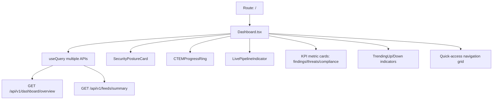

# PRD — Community 427: Main Dashboard Page (aldeci legacy)

## Master Goal Mapping
- **Platform Goal**: Command center homepage — aggregates all security KPIs, pipeline status, threat feeds, and quick-access widgets
- **Persona**: SOC Manager, CISO, Security Analyst — primary daily-use page
- **ALDECI Pillar**: Security Operations Center / Command Dashboard (Legacy)

## Architecture Diagram


## Code Proof
- **File**: `suite-ui/aldeci/src/pages/Dashboard.tsx:1-80+`
- **Imports**: useQuery, useNavigate, motion, useMemo, Shield, AlertTriangle, TrendingUp, Activity, Database, Brain, Swords, CheckCircle2, ArrowUpRight/Down
- **Pattern**: Multiple useQuery hooks → useMemo for derived stats → motion.div grid

## Inter-Dependencies
- **Components**: SecurityPostureCard, CTEMProgressRing, LivePipelineIndicator
- **API**: dashboardApi (overview), feedsApi (summary)
- **Navigation**: useNavigate for quick-access cards

## Data Flow
```
Parallel useQuery fetches → useMemo computes KPI deltas →
motion.div stagger animation on card mount →
ArrowUpRight (positive trend) / ArrowDownRight (negative) →
Click quick-access card → navigate to feature page
```

## Acceptance Criteria
- [ ] All KPI cards load with real data
- [ ] Trend arrows colored correctly
- [ ] Stagger animation on page load
- [ ] SecurityPostureCard, CTEMProgressRing, LivePipelineIndicator all render
- [ ] Quick-access grid navigates to correct routes
- [ ] Loading skeletons while fetching

## Effort Estimate
**L** — 3 days (complete, frozen)

## Status
**DONE** — Frozen legacy command dashboard
