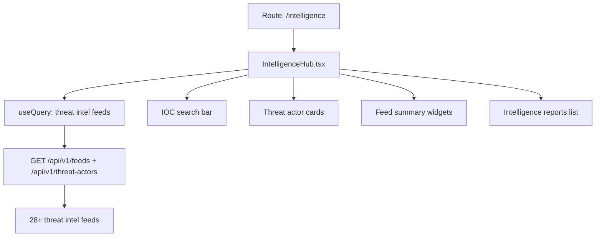

# PRD — Community 428: Intelligence Hub Page (aldeci legacy)

## Master Goal Mapping
- **Platform Goal**: Threat intelligence aggregation — IOC search, threat actor profiles, feed summaries, intelligence reports
- **Persona**: Threat Intelligence Analyst, SOC Tier 2/3
- **ALDECI Pillar**: Threat Intelligence / TIP (Legacy)

## Architecture Diagram


## Code Proof
- **File**: `suite-ui/aldeci/src/pages/IntelligenceHub.tsx:1-60+`
- **Imports**: useState, useQuery, motion, Brain, Search, AlertTriangle, Shield, TrendingUp, ExternalLink, ChevronDown, RefreshCw
- **Components**: Card, CardContent, CardDescription, CardHeader, CardTitle, Badge

## Inter-Dependencies
- **Backend**: ThreatIntelPlatform engine, 28+ feeds (suite-feeds/)
- **API**: `/api/v1/feeds`, `/api/v1/threat-actors`
- **Related**: IOCHunter page, WatchlistManager, ThreatIntelAutomation

## Data Flow
```
useQuery feeds → feed health cards →
IOC search → POST /api/v1/ioc-enrichment →
Results: confidence score + source attribution →
Threat actor profiles from threat-actors API
```

## Acceptance Criteria
- [ ] Feed health status per source (28+ feeds)
- [ ] IOC search with type detection (IP/domain/hash/URL)
- [ ] Threat actor cards with attribution
- [ ] Report list sortable by date
- [ ] ExternalLink to source feeds

## Effort Estimate
**L** — 3 days (complete, frozen)

## Status
**DONE** — Frozen legacy intelligence page
