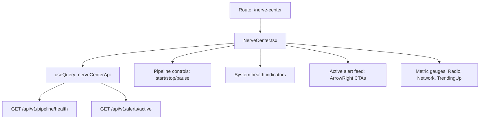

# PRD — Community 429: Nerve Center Page (aldeci legacy)

## Master Goal Mapping
- **Platform Goal**: Operational command center — pipeline control, alert triage, system health, real-time metrics
- **Persona**: SOC Analyst, Security Operations Lead
- **ALDECI Pillar**: Security Operations / SOC Workflow (Legacy)

## Architecture Diagram


## Code Proof
- **File**: `suite-ui/aldeci/src/pages/NerveCenter.tsx:1-60+`
- **API**: `nerveCenterApi` from `../lib/api`
- **Icons**: Brain, Activity, Shield, Zap, CheckCircle2, ArrowRight, Radio, Network, TrendingUp
- **Mutation**: `useMutation` for pipeline control actions
- **Toast**: `sonner` for action feedback

## Inter-Dependencies
- **Backend**: brain_pipeline.py, alerts system
- **API**: nerveCenterApi wrapper
- **Related**: LivePipelineIndicator (component used here too)

## Data Flow
```
nerveCenterApi.getStatus() → system health →
Active alerts rendered with severity →
Pipeline control button → useMutation → POST /api/v1/pipeline/control →
toast.success/error feedback
```

## Acceptance Criteria
- [ ] Pipeline start/stop/pause controls work
- [ ] System health gauges show real data
- [ ] Active alert feed with navigate-to-detail
- [ ] Toast notifications on control actions
- [ ] Radio/Network icons for connectivity status

## Effort Estimate
**L** — 2 days (complete, frozen)

## Status
**DONE** — Frozen legacy SOC command page
