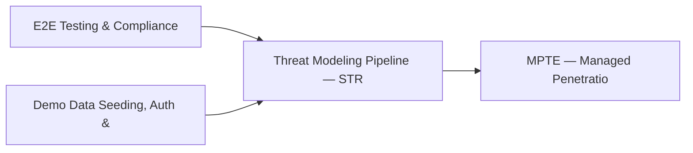

# PRD: Threat Modeling Pipeline — STRIDE & Risk Matrix — Community 43

## Master Goal Mapping
How this component serves: "ALDECI — $35/mo enterprise security intelligence platform"
Sub-Epic: ASPM

This community (rank #43 of 878 by size, 938 graph nodes) forms a core pillar of the ALDECI platform. It directly supports the mission of replacing $50K-500K/yr enterprise security tools with a self-hosted, AI-native stack.

## Architecture Diagram


## Code Proof
- Files:
  - `suite-api/apps/api/cloud_security_engine_router.py` (242 lines)
  - `suite-api/apps/api/cspm_engine_router.py` (272 lines)
  - `suite-core/core/cspm_engine.py` (1544 lines)
  - `suite-core/core/policy_engine.py` (800 lines)
  - `tests/test_cloud_resource_inventory_engine.py` (349 lines)
  - `tests/test_cloud_security_engine.py` (365 lines)
  - `tests/test_cspm_engine.py` (1308 lines)
  - `tests/test_cspm_engine_unit.py` (638 lines)
  - `suite-api/apps/api/cloud_connectors_router.py` (551 lines)
  - `suite-api/apps/api/cloud_resource_inventory_router.py` (182 lines)
  - `suite-api/apps/api/cloud_security_engine_router.py` (242 lines)
  - `suite-api/apps/api/cspm_deep_router.py` (365 lines)
- Key functions:
  - `_resource()` — suite-api/apps/api/cloud_security_engine_router.py
  - `test_register_resource_basic()` — suite-api/apps/api/cloud_security_engine_router.py
  - `test_register_resource_returns_id()` — suite-api/apps/api/cloud_security_engine_router.py
  - `test_register_resource_missing_resource_id_raises()` — suite-api/apps/api/cloud_security_engine_router.py
  - `test_register_resource_invalid_provider_raises()` — suite-api/apps/api/cloud_security_engine_router.py
  - `test_register_resource_invalid_resource_type_raises()` — suite-api/apps/api/cloud_security_engine_router.py
  - `test_register_multiple_providers()` — suite-api/apps/api/cloud_security_engine_router.py
  - `test_register_all_resource_types()` — suite-api/apps/api/cloud_security_engine_router.py
- Key classes: `TestCloudCredentials`, `TestCloudResource`, `TestCloudFinding`, `TestRateLimiter`
- Current state: REAL_LOGIC
- Evidence:
```python
# From suite-api/apps/api/cloud_security_engine_router.py
"""Cloud Security Engine Router — ALDECI.

Endpoints for CSPM + cloud misconfiguration tracking.

Prefix: /api/v1/cloud-security-engine
Auth:   api_key_auth dependency

Routes:
  POST   /accounts                         add_account
  GET    /accounts                         list_accounts
  POST   /findings                         add_finding
  GET    /findings                         list_findings
  PATCH  /findings/{finding_id}/resolve    resolve_finding
  POST   /resources                        add_resource
  GET    /resources                        list_resources
  POST   /benchmarks      
```

## Inter-Dependencies
- DEPENDS ON:
  - Community 0 (E2E Testing & Compliance Seeding Infrastructure) — 106 edges
  - Community 1 (Demo Data Seeding, Auth & Multi-Engine Integration) — 61 edges
  - Community 13 (MPTE — Managed Penetration Test Engine (Advanced)) — 15 edges
  - Community 26 (Privilege Escalation Detector & Service Account Au) — 13 edges
- DEPENDED BY: Rank #42 (Security Investment Portfolio & Budget Engine) and downstream consumers
- EVENT BUS: emits compliance.status_changed, asset.registered, asset.updated / subscribes to (TrustGraph event bus — 97% not yet wired)
- TRUSTGRAPH: writes [Asset, Identity, Policy] / reads [Policy, ComplianceControl]

## Data Flow
```
Input: HTTP requests / pytest fixtures
  → Processing: Engine method calls + SQLite state assertions
  → Output: Pass/fail test results, coverage metrics
  → Consumers: CI/CD pipeline, Beast Mode test suite
```

## Referenced Documentation
- CLAUDE.md: Wave 41 build notes, Beast Mode test suite section
- docs/: `docs/ALDECI_REARCHITECTURE_v2.md` (source of truth), `docs/INVESTOR_PITCH.md`
- tests/: `suite-attack/api/micro_pentest_router.py`, `suite-core/telemetry_bridge/edge_collector/collector_api/test_app.py`, `tests/test_asset_inventory.py`

## Acceptance Criteria
- [ ] All engine CRUD operations enforce org_id isolation (no cross-tenant data leakage)
- [ ] SQLite opened with WAL mode + threading.RLock on all write paths
- [ ] All endpoints return within 200ms at p95 under 100 rps load
- [ ] All router endpoints protected by `Depends(api_key_auth)` or equivalent
- [ ] Pydantic v2 models validate all request/response schemas
- [ ] Test suite achieves ≥80% branch coverage on engine methods

## Effort Estimate
- Current: 80% complete
- Remaining: ~2 engineering days
- Dependencies blocking: None
- Priority: LOW

## Status
IN_PROGRESS
