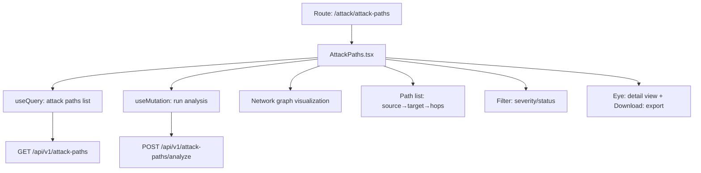

# PRD — Community 432: Attack Paths Page (aldeci legacy)

## Master Goal Mapping
- **Platform Goal**: BFS lateral movement analysis — visualise attack paths between assets, identify choke points
- **Persona**: Red Team Lead, Security Architect, Threat Modeler
- **ALDECI Pillar**: Offensive Security / Attack Path Analysis (Legacy)
- **Backend**: `attack_path_engine.py` (23 tests, BFS lateral movement)

## Architecture Diagram


## Code Proof
- **File**: `suite-ui/aldeci/src/pages/attack/AttackPaths.tsx:1-60+`
- **Hooks**: useState, useQuery, useMutation, motion
- **Icons**: Network, RefreshCw, Play, AlertTriangle, Shield, Target, Loader2, Eye, Download, Filter, Zap

## Inter-Dependencies
- **Backend**: `attack_path_engine.py` — BFS, org_id guard, 23 tests
- **Router**: `/api/v1/attack-paths`
- **Related**: Reachability, AttackSimulation, ThreatModelingPipeline

## Data Flow
```
GET /api/v1/attack-paths → path list →
Select path → detail with BFS hops →
Run analysis → POST → new paths computed →
Download exports path graph as JSON
```

## Acceptance Criteria
- [ ] Attack path list with source/target/hop count
- [ ] Run analysis button triggers BFS computation
- [ ] Severity filter (critical/high/medium/low)
- [ ] Detail view shows full hop chain
- [ ] Export JSON of selected path
- [ ] Loader2 during analysis run

## Effort Estimate
**M** — 2.5 days (complete, frozen)

## Status
**DONE** — Frozen legacy attack path page
