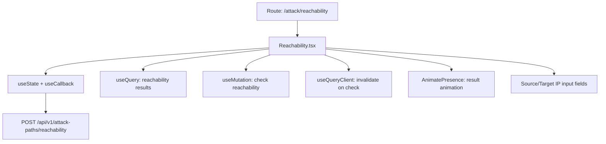

# PRD — Community 433: Reachability Analysis Page (aldeci legacy)

## Master Goal Mapping
- **Platform Goal**: Network reachability checking — can attacker reach target? BFS-based path existence check
- **Persona**: Network Security Engineer, Red Team
- **ALDECI Pillar**: Offensive Security / Reachability (Legacy)

## Architecture Diagram


## Code Proof
- **File**: `suite-ui/aldeci/src/pages/attack/Reachability.tsx:1-60+`
- **Hooks**: useState, useCallback, useQuery, useMutation, useQueryClient, motion, AnimatePresence
- **Icons**: Search, Network, CheckCircle2, XCircle, Loader2, RefreshCw, ArrowRight, BarChart3, Shield, Activity, Eye

## Inter-Dependencies
- **Backend**: attack_path_engine.py BFS reachability check
- **Router**: `/api/v1/attack-paths/reachability`
- **Related**: AttackPaths (sibling page)

## Data Flow
```
User enters source + target IP/asset →
useMutation POST /reachability →
useQueryClient.invalidateQueries →
AnimatePresence reveals result: reachable(XCircle red) or unreachable(CheckCircle2 green)
```

## Acceptance Criteria
- [ ] Source and target asset inputs
- [ ] Reachability result with clear yes/no display
- [ ] Path shown if reachable (hop count, intermediate nodes)
- [ ] AnimatePresence for result reveal
- [ ] History of recent checks via useQuery

## Effort Estimate
**M** — 2 days (complete, frozen)

## Status
**DONE** — Frozen legacy reachability page
