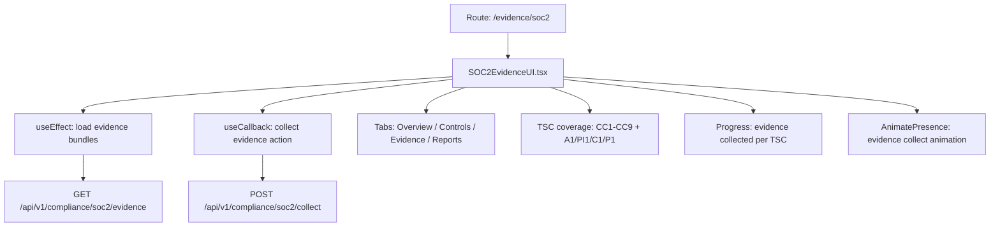

# PRD — Community 435: SOC 2 Evidence UI (aldeci legacy)

## Master Goal Mapping
- **Platform Goal**: SOC 2 Type II evidence collection and review — Trust Service Criteria evidence bundles, control status
- **Persona**: Compliance Officer, Auditor, SOC Manager
- **ALDECI Pillar**: GRC / SOC 2 Compliance (Legacy)
- **Backend**: `compliance_engine.py` (SOC2 framework), evidence chain engine

## Architecture Diagram


## Code Proof
- **File**: `suite-ui/aldeci/src/pages/evidence/SOC2EvidenceUI.tsx:1-70+`
- **Hooks**: useEffect, useState, useCallback (no React Query — uses useEffect pattern)
- **Components**: Card, CardHeader, CardTitle, CardContent, CardDescription, Button, Badge, Input, Progress, Skeleton, Tabs
- **API**: `api` from `../../lib/api`

## Inter-Dependencies
- **Backend**: `compliance_engine.py` — SOC2 Type II (CC1-CC9, A1, PI1, C1, P1 controls)
- **Evidence chain**: `evidence_chain_engine.py` — tamper-evident custody
- **Related**: SLSAProvenance, AuditLogs, ComplianceMappingDashboard

## Data Flow
```
useEffect → GET /api/v1/compliance/soc2/evidence →
TSC coverage % computed per control family →
Collect evidence → POST → evidence bundle created →
Tamper-evident chain updated → progress bar increments
```

## Acceptance Criteria
- [ ] All 14 TSC families displayed (CC1-CC9, A1, PI1, C1, P1)
- [ ] Evidence count and coverage % per TSC
- [ ] Collect button triggers evidence gathering
- [ ] Progress bar for overall SOC 2 readiness
- [ ] Tabs: Overview (score), Controls (list), Evidence (bundles), Reports
- [ ] Skeleton while loading

## Effort Estimate
**L** — 3 days (complete, frozen)

## Status
**DONE** — Frozen legacy SOC 2 compliance page
