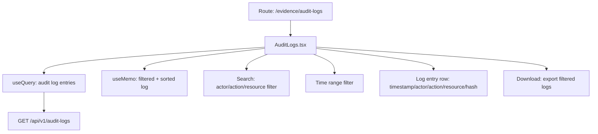

# PRD — Community 436: Audit Logs Page (aldeci legacy)

## Master Goal Mapping
- **Platform Goal**: Immutable audit trail viewer — security events, user actions, system changes with cryptographic proof
- **Persona**: Compliance Officer, Auditor, Security Analyst (forensics)
- **ALDECI Pillar**: Evidence / Audit Trail (Legacy)

## Architecture Diagram


## Code Proof
- **File**: `suite-ui/aldeci/src/pages/evidence/AuditLogs.tsx:1-70+`
- **Hooks**: useState, useMemo, useQuery, motion
- **Icons**: ScrollText, Search, Filter, RefreshCw, Clock, User, Shield, AlertTriangle, CheckCircle2, Settings, Database, Eye, Download, Fingerprint, Hash, Activity
- **useMemo**: filters log by search text + time range + event type

## Inter-Dependencies
- **Backend**: Evidence chain engine, audit log router
- **API**: `/api/v1/audit-logs`
- **Related**: SOC2EvidenceUI (references audit trail), EvidenceVault

## Data Flow
```
useQuery audit-logs → useMemo filter by search/time/type →
Log entries rendered with timestamp + actor + action →
Hash (Fingerprint icon) shown per entry →
Download exports filtered CSV
```

## Acceptance Criteria
- [ ] Full-text search across actor/action/resource
- [ ] Time range filter (last 1h/24h/7d/30d/custom)
- [ ] Event type filter (auth/config/data/security)
- [ ] Per-entry hash displayed (tamper evidence)
- [ ] Export to CSV
- [ ] Pagination or virtual scroll for large logs

## Effort Estimate
**M** — 2 days (complete, frozen)

## Status
**DONE** — Frozen legacy audit log viewer
