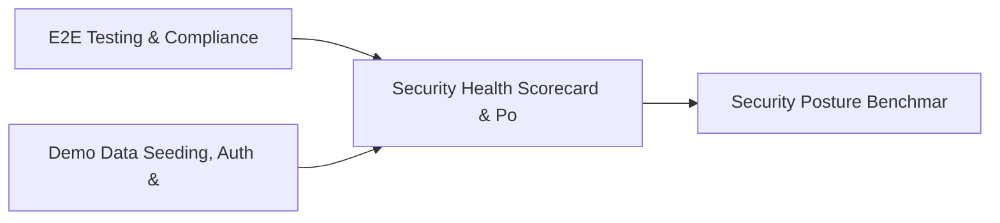

# PRD: Security Health Scorecard & Posture History — Community 44

## Master Goal Mapping
How this component serves: "ALDECI — $35/mo enterprise security intelligence platform"
Sub-Epic: Executive

This community (rank #44 of 878 by size, 849 graph nodes) forms a core pillar of the ALDECI platform. It directly supports the mission of replacing $50K-500K/yr enterprise security tools with a self-hosted, AI-native stack.

## Architecture Diagram


## Code Proof
- Files:
  - `suite-api/apps/api/cloud_security_engine_router.py` (242 lines)
  - `suite-api/apps/api/security_scorecard_engine_router.py` (227 lines)
  - `suite-core/core/security_benchmark_engine.py` (415 lines)
  - `suite-core/core/security_scorecard_engine.py` (578 lines)
  - `suite-core/core/vuln_intel_fusion_engine.py` (488 lines)
  - `suite-core/core/vuln_prioritization_engine.py` (572 lines)
  - `suite-core/core/vulnerability_scoring_engine.py` (422 lines)
  - `tests/test_cloud_security_engine.py` (365 lines)
  - `suite-api/apps/api/cloud_security_engine_router.py` (242 lines)
  - `suite-api/apps/api/incident_cost_router.py` (180 lines)
  - `suite-api/apps/api/posture_score_router.py` (116 lines)
  - `suite-api/apps/api/security_benchmark_router.py` (163 lines)
- Key functions:
  - `engine()` — suite-api/apps/api/cloud_security_engine_router.py
  - `_make_scorecard()` — suite-api/apps/api/cloud_security_engine_router.py
  - `org()` — suite-api/apps/api/cloud_security_engine_router.py
  - `org2()` — suite-api/apps/api/cloud_security_engine_router.py
  - `_vuln()` — suite-api/apps/api/cloud_security_engine_router.py
- Key classes: `TestGradeHelper`, `TestCreateScorecard`, `TestListAndGetScorecards`, `TestTrends`, `TestCompareToBenchmark`, `TestScorecardStats`
- Current state: REAL_LOGIC
- Evidence:
```python
# From suite-api/apps/api/cloud_security_engine_router.py
"""Cloud Security Engine Router — ALDECI.

Endpoints for CSPM + cloud misconfiguration tracking.

Prefix: /api/v1/cloud-security-engine
Auth:   api_key_auth dependency

Routes:
  POST   /accounts                         add_account
  GET    /accounts                         list_accounts
  POST   /findings                         add_finding
  GET    /findings                         list_findings
  PATCH  /findings/{finding_id}/resolve    resolve_finding
  POST   /resources                        add_resource
  GET    /resources                        list_resources
  POST   /benchmarks      
```

## Inter-Dependencies
- DEPENDS ON:
  - Community 0 (E2E Testing & Compliance Seeding Infrastructure) — 116 edges
  - Community 1 (Demo Data Seeding, Auth & Multi-Engine Integration) — 35 edges
  - Community 28 (Security Posture Benchmarking & Maturity Engine) — 9 edges
  - Community 30 (AI-Powered SOC & Deception Analytics Engine) — 8 edges
- DEPENDED BY: Rank #43 (Threat Modeling Pipeline — STRIDE & Risk Matrix) and downstream consumers
- EVENT BUS: emits vulnerability.detected, vulnerability.patched, asset.registered, asset.updated / subscribes to (TrustGraph event bus — 97% not yet wired)
- TRUSTGRAPH: writes [Vulnerability, Asset, Incident] / reads [Incident, CloudResource]

## Data Flow
```
Input: HTTP requests / pytest fixtures
  → Processing: Engine method calls + SQLite state assertions
  → Output: Pass/fail test results, coverage metrics
  → Consumers: CI/CD pipeline, Beast Mode test suite
```

## Referenced Documentation
- CLAUDE.md: Wave 41 build notes, Beast Mode test suite section
- docs/: `docs/ALDECI_REARCHITECTURE_v2.md` (source of truth), `docs/INVESTOR_PITCH.md`
- tests/: `tests/test_attack_surface_monitor.py`, `tests/test_backup_validator.py`, `tests/test_cloud_security_engine.py`

## Acceptance Criteria
- [ ] All engine CRUD operations enforce org_id isolation (no cross-tenant data leakage)
- [ ] SQLite opened with WAL mode + threading.RLock on all write paths
- [ ] All endpoints return within 200ms at p95 under 100 rps load
- [ ] All router endpoints protected by `Depends(api_key_auth)` or equivalent
- [ ] Pydantic v2 models validate all request/response schemas
- [ ] Test suite achieves ≥80% branch coverage on engine methods

## Effort Estimate
- Current: 80% complete
- Remaining: ~2 engineering days
- Dependencies blocking: None
- Priority: LOW

## Status
IN_PROGRESS
