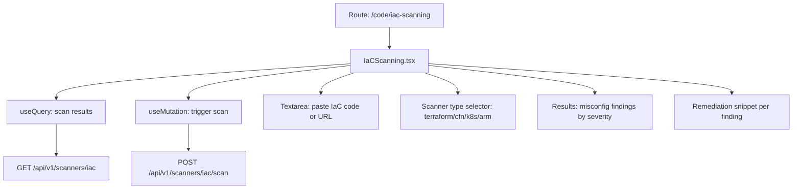

# PRD — Community 440: Infrastructure as Code Scanning Page (aldeci legacy)

## Master Goal Mapping
- **Platform Goal**: IaC security scanning — Terraform/CloudFormation/Kubernetes manifest analysis for misconfigurations
- **Persona**: DevSecOps Engineer, Cloud Engineer, Platform Engineer
- **ALDECI Pillar**: Code Security / IaC Scanning (Legacy)
- **Backend**: `dast_engine.py`, `compliance_scanner_engine.py`

## Architecture Diagram


## Code Proof
- **File**: `suite-ui/aldeci/src/pages/code/IaCScanning.tsx:1-60+`
- **Hooks**: useState, useMemo, useQuery, useMutation, motion
- **Icons**: Cloud, Play, CheckCircle2, AlertTriangle, Shield, Loader2, FileCode, Search, BarChart3
- **Components**: Card, Button, Badge, Input, Textarea

## Inter-Dependencies
- **Backend**: Scanner normalizers for IaC (Checkov, tfsec, etc.)
- **API**: `/api/v1/scanners/iac`
- **Related**: ScannerDashboard, DataFabric, VulnHeatmap

## Data Flow
```
User pastes IaC code OR enters repo URL →
Select scanner type → POST /scan →
Loader2 during scan → results: findings by severity →
Misconfig details with resource path + line →
Remediation snippet shown per finding
```

## Acceptance Criteria
- [ ] Textarea for IaC code paste
- [ ] Scanner type selector (terraform/cfn/k8s/helm/arm)
- [ ] Scan trigger with loading state
- [ ] Results: finding count by severity
- [ ] Finding details with file path and line number
- [ ] Remediation snippet per finding

## Effort Estimate
**M** — 2 days (complete, frozen)

## Status
**DONE** — Frozen legacy IaC scanning page
