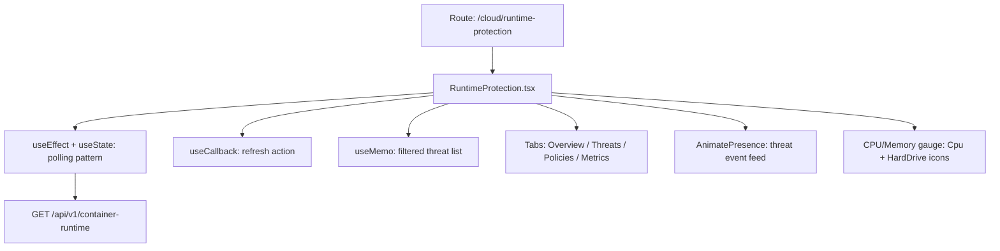

# PRD — Community 441: Runtime Protection Page (aldeci legacy)

## Master Goal Mapping
- **Platform Goal**: Real-time container and workload runtime protection — threat events, policy violations, performance metrics
- **Persona**: Cloud Security Engineer, Platform Engineer, SOC Analyst
- **ALDECI Pillar**: Cloud Security / Runtime Protection (Legacy)
- **Backend**: `container_runtime_security_engine.py` (101 tests)

## Architecture Diagram


## Code Proof
- **File**: `suite-ui/aldeci/src/pages/cloud/RuntimeProtection.tsx:1-70+`
- **Hooks**: useEffect, useState, useCallback, useMemo
- **Icons**: Shield, AlertTriangle, Server, Activity, RefreshCw, Wifi, WifiOff, Cpu, HardDrive, Eye, Search
- **Components**: Card, Button, Badge, Tabs, Progress, Skeleton, Input
- **Pattern**: useEffect polling (not React Query — legacy pattern)

## Inter-Dependencies
- **Backend**: `container_runtime_security_engine.py` — 101 tests, container lifecycle, violations
- **Router**: `/api/v1/container-runtime`
- **Related**: ContainerRegistrySecurity, KubernetesSecurity, CloudNativeSecurity

## Data Flow
```
useEffect interval → GET /api/v1/container-runtime →
Threat events feed with AnimatePresence →
CPU/Memory from container metrics →
Policy violations tab →
Search/filter useMemo on threat list
```

## Acceptance Criteria
- [ ] Real-time threat event feed (polling)
- [ ] CPU/Memory gauges per container
- [ ] Policy violation list
- [ ] Online/offline indicator per workload
- [ ] Search filters threat list
- [ ] Skeleton loading on initial fetch

## Effort Estimate
**L** — 3 days (complete, frozen)

## Status
**DONE** — Frozen legacy runtime protection page
