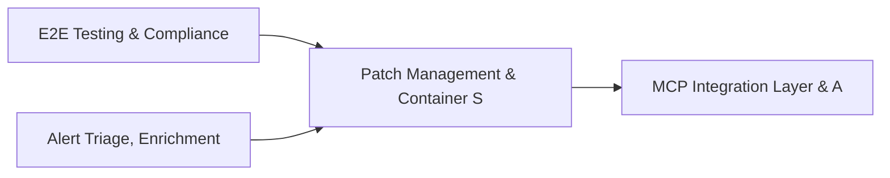

# PRD: Patch Management & Container Security Posture — Community 45

## Master Goal Mapping
How this component serves: "ALDECI — $35/mo enterprise security intelligence platform"
Sub-Epic: Identity

This community (rank #45 of 878 by size, 836 graph nodes) forms a core pillar of the ALDECI platform. It directly supports the mission of replacing $50K-500K/yr enterprise security tools with a self-hosted, AI-native stack.

## Architecture Diagram


## Code Proof
- Files:
  - `suite-core/core/access_control_engine.py` (400 lines)
  - `suite-core/core/compliance_engine.py` (1821 lines)
  - `suite-core/core/identity_lifecycle_engine.py` (457 lines)
  - `suite-core/core/services/enterprise/compliance_engine.py` (125 lines)
  - `tests/test_access_control_engine.py` (390 lines)
  - `tests/test_access_request_management_engine.py` (375 lines)
  - `tests/test_identity_lifecycle_engine.py` (447 lines)
  - `tests/test_pam_engine.py` (275 lines)
  - `suite-api/apps/api/access_control_router.py` (192 lines)
  - `suite-api/apps/api/access_matrix_router.py` (200 lines)
  - `suite-api/apps/api/access_request_management_router.py` (163 lines)
  - `suite-api/apps/api/compliance_automation_router.py` (352 lines)
- Key functions:
  - `engine()` — suite-core/core/access_control_engine.py
  - `_policy()` — suite-core/core/access_control_engine.py
  - `_create_policy()` — suite-core/core/access_control_engine.py
  - `_create_grant()` — suite-core/core/access_control_engine.py
  - `test_init_twice_idempotent()` — suite-core/core/access_control_engine.py
  - `test_create_policy_returns_record()` — suite-core/core/access_control_engine.py
  - `test_create_policy_generates_uuid()` — suite-core/core/access_control_engine.py
  - `test_create_policy_all_resource_types()` — suite-core/core/access_control_engine.py
- Key classes: `TestEnums`, `TestSLAConfig`, `TestComponentConfig`, `TestScannerConfig`, `TestAppConfig`
- Current state: REAL_LOGIC
- Evidence:
```python
# From suite-core/core/access_control_engine.py
"""Access Control Engine — ALDECI.

Manages access policies, grants, revocations, and access checks.

Features:
- Policy lifecycle (create/list/get) per resource type and action
- Grant management: grant access with optional expiry, revoke with audit trail
- Access check: list active grants for subject+resource with policy details
- Stats: by resource type, effect, grant status

Compliance: NIST SP 800-53 AC controls, ISO 27001 A.9 (Access Control),
            CIS Control 6 (Access Control Management)
"""

from __future__ import annotations

import json
import logging
import sqlite3
import th
```

## Inter-Dependencies
- DEPENDS ON:
  - Community 0 (E2E Testing & Compliance Seeding Infrastructure) — 187 edges
  - Community 37 (Alert Triage, Enrichment & Priority Queue Engine) — 43 edges
  - Community 3 (MCP Integration Layer & API Key / Auth Management) — 28 edges
  - Community 1 (Demo Data Seeding, Auth & Multi-Engine Integration) — 23 edges
- DEPENDED BY: Rank #44 (Security Health Scorecard & Posture History) and downstream consumers
- EVENT BUS: emits compliance.status_changed, policy.violated, policy.enforced / subscribes to (TrustGraph event bus — 97% not yet wired)
- TRUSTGRAPH: writes [Identity, Policy, ComplianceControl] / reads [Policy, ComplianceControl]

## Data Flow
```
Input: HTTP requests / pytest fixtures
  → Processing: Engine method calls + SQLite state assertions
  → Output: Pass/fail test results, coverage metrics
  → Consumers: CI/CD pipeline, Beast Mode test suite
```

## Referenced Documentation
- CLAUDE.md: Wave 41 build notes, Beast Mode test suite section
- docs/: `docs/ALDECI_REARCHITECTURE_v2.md` (source of truth), `docs/INVESTOR_PITCH.md`
- tests/: `tests/test_access_control_engine.py`, `tests/test_access_matrix.py`, `tests/test_access_request_management_engine.py`

## Acceptance Criteria
- [ ] All engine CRUD operations enforce org_id isolation (no cross-tenant data leakage)
- [ ] SQLite opened with WAL mode + threading.RLock on all write paths
- [ ] All endpoints return within 200ms at p95 under 100 rps load
- [ ] All router endpoints protected by `Depends(api_key_auth)` or equivalent
- [ ] Pydantic v2 models validate all request/response schemas
- [ ] Test suite achieves ≥80% branch coverage on engine methods

## Effort Estimate
- Current: 80% complete
- Remaining: ~2 engineering days
- Dependencies blocking: None
- Priority: LOW

## Status
IN_PROGRESS
