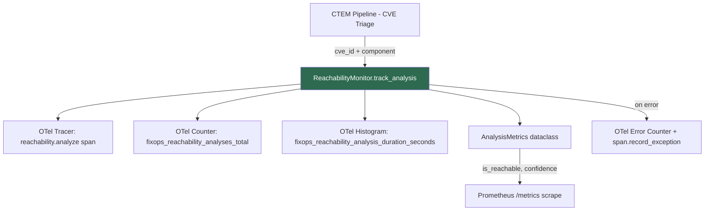

# PRD: Community 450 — ReachabilityMonitor.track_analysis

## Master Goal Mapping
**ALDECI Pillar**: CTEM — Exploitability Verification Observability
**Persona**: Security Engineer, SOC Analyst
**Business Value**: Provides OpenTelemetry-instrumented observability for every reachability analysis operation, enabling MTTR measurement and SLA compliance for CVE triage workflows.

## Architecture Diagram


## Code Proof
**File**: `suite-evidence-risk/risk/reachability/monitoring.py:85-175`
```python
@contextmanager
def track_analysis(self, cve_id: str, component_name: str) -> Iterator[AnalysisMetrics]:
    start_time = time.time()
    metrics = AnalysisMetrics(cve_id=cve_id, component_name=component_name,
                               analysis_duration=0.0, is_reachable=False, confidence="unknown")
    span = None
    if self.enable_tracing:
        span = _TRACER.start_as_current_span("reachability.analyze", attributes={...})
    try:
        yield metrics
        self._analyses_total += 1
        if self.enable_metrics:
            _ANALYSIS_COUNTER.add(1, {"status": "success", ...})
    except (ValueError, KeyError, RuntimeError, TypeError, AttributeError) as e:
        metrics.error = str(e)
        _ANALYSIS_ERRORS.add(1, {...})
    finally:
        metrics.analysis_duration = time.time() - start_time
        _ANALYSIS_DURATION.record(metrics.analysis_duration, {...})
```

## Inter-Dependencies
- **Upstream**: `telemetry.get_tracer`, `telemetry.get_meter` (OTel SDK)
- **Downstream**: `ReachabilityAnalyzer` (caller of this context manager)
- **Sibling**: `track_repo_clone` (Community 451), `AnalysisMetrics` dataclass
- **Infrastructure**: Prometheus exporter at `/metrics`, OTLP collector

## Data Flow
```
CVE triage request
  → track_analysis(cve_id, component)
    → OTel span start (tracing)
    → yield AnalysisMetrics (caller fills is_reachable, confidence)
    → on exit: record counter + histogram
    → span.set_attribute(is_reachable, confidence) + span.end()
  → Prometheus scrape /metrics → Grafana dashboard
```

## Referenced Docs
- `suite-evidence-risk/risk/reachability/monitoring.py` (lines 85-175)
- NIST SP 800-137 (ISCM — continuous monitoring)
- OpenTelemetry Python SDK docs

## Acceptance Criteria
- [ ] `track_analysis` emits `fixops_reachability_analyses_total` counter on success
- [ ] `fixops_reachability_analysis_duration_seconds` histogram populated on every call
- [ ] On exception: `fixops_reachability_analysis_errors_total` incremented, span marked error
- [ ] `AnalysisMetrics.analysis_duration` always populated (finally block)
- [ ] In-process counters readable via `get_metrics_summary()`
- [ ] Tracing can be disabled via `config={"enable_tracing": False}`

## Effort Estimate
**XS** — 1 day. Context manager is complete; integration tests + Prometheus scrape verification.

## Status
**COMPLETE** — Implementation exists. Needs integration test coverage.
