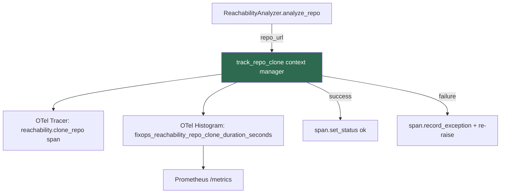

# PRD: Community 451 — ReachabilityMonitor.track_repo_clone

## Master Goal Mapping
**ALDECI Pillar**: CTEM — Repository Ingestion Observability
**Persona**: DevSecOps Engineer
**Business Value**: Instruments git clone operations that precede static reachability analysis, providing latency histograms for capacity planning and SLO tracking on repository fetch times.

## Architecture Diagram


## Code Proof
**File**: `suite-evidence-risk/risk/reachability/monitoring.py:176-213`
```python
@contextmanager
def track_repo_clone(self, repo_url: str) -> Iterator[None]:
    start_time = time.time()
    span = None
    if self.enable_tracing:
        span = _TRACER.start_as_current_span("reachability.clone_repo",
                  attributes={"fixops.reachability.repo_url": repo_url})
    try:
        yield
        if span:
            span.set_status("ok")
    except (ValueError, KeyError, RuntimeError, TypeError, AttributeError) as e:
        if span:
            span.set_status("error", str(e))
            span.record_exception(e)
        raise
    finally:
        duration = time.time() - start_time
        if self.enable_metrics:
            _REPO_CLONE_DURATION.record(duration, {"repo_url": repo_url})
        if span:
            span.end()
```

## Inter-Dependencies
- **Upstream**: `ReachabilityAnalyzer` calls this before git clone subprocess
- **Sibling**: `track_analysis` (Community 450)
- **Infrastructure**: OTel histogram, Prometheus scrape endpoint

## Data Flow
```
analyze_repo(repo_url)
  → track_repo_clone(repo_url)
    → OTel span start
    → yield (caller does git clone)
    → finally: record histogram duration
    → span.end()
```

## Referenced Docs
- `suite-evidence-risk/risk/reachability/monitoring.py` (lines 176-213)

## Acceptance Criteria
- [ ] `fixops_reachability_repo_clone_duration_seconds` recorded on every clone
- [ ] Span attribute `fixops.reachability.repo_url` set on start
- [ ] Exception re-raised after span error recording
- [ ] Works with tracing disabled

## Effort Estimate
**XS** — 0.5 days. Implementation complete; add unit test with mock tracer.

## Status
**COMPLETE** — Implementation exists. Needs unit test.
