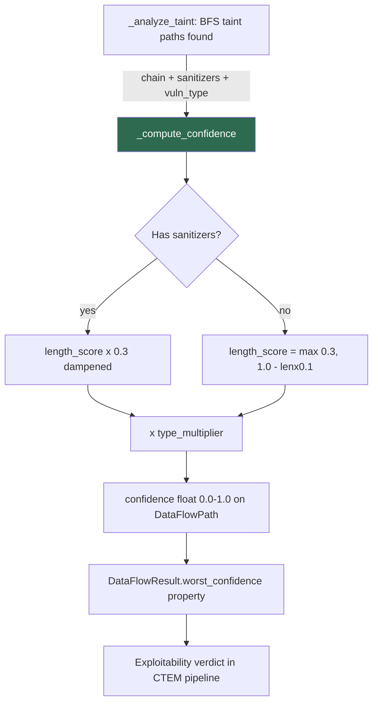

# PRD: Community 452 — DataFlowAnalyzer._compute_confidence

## Master Goal Mapping
**ALDECI Pillar**: CTEM — Exploit Confidence Scoring
**Persona**: Vulnerability Analyst
**Business Value**: Converts raw taint paths into a 0.0-1.0 exploit confidence score, enabling analysts to prioritize CVEs by actual exploitability rather than CVSS fear-score alone.

## Architecture Diagram


## Code Proof
**File**: `suite-evidence-risk/risk/reachability/data_flow.py:498-520`
```python
@staticmethod
def _compute_confidence(chain: List[str], sanitizers: List[str], vuln_type: str) -> float:
    length_score = max(0.3, 1.0 - (len(chain) - 2) * 0.1)
    if sanitizers:
        length_score *= 0.3
    type_multiplier = {
        "sql_injection": 1.0, "command_injection": 1.0,
        "xss": 0.9, "ssrf": 0.95, "path_traversal": 0.85, "deserialization": 0.8,
    }.get(vuln_type, 0.7)
    return round(min(1.0, length_score * type_multiplier), 3)
```

## Inter-Dependencies
- **Upstream**: `_bfs_taint` (returns chain), `_analyze_taint` (calls _compute_confidence)
- **Downstream**: `DataFlowPath.confidence`, `DataFlowResult.worst_confidence`
- **Consumer**: CTEM pipeline exploitability verdict, risk prioritization engine

## Data Flow
```
BFS taint path found (chain=[src, fn1, fn2, sink])
  → _compute_confidence(chain, [], "sql_injection")
    → length_score = max(0.3, 1.0 - 2x0.1) = 0.8
    → no sanitizers
    → type_multiplier = 1.0
    → return round(min(1.0, 0.8), 3) = 0.8
  → DataFlowPath.confidence = 0.8
```

## Referenced Docs
- `suite-evidence-risk/risk/reachability/data_flow.py` (lines 498-520)
- FIRST EPSS methodology (exploit prediction)

## Acceptance Criteria
- [ ] Chain length 2 → confidence = type_multiplier (e.g. 1.0 for sql_injection)
- [ ] Chain length 12+ → length_score clamped to 0.3
- [ ] Sanitized paths: confidence <= 0.3 x type_multiplier
- [ ] Returns float in [0.0, 1.0], rounded to 3 decimal places
- [ ] Unknown vuln_type → multiplier 0.7

## Effort Estimate
**XS** — 0.5 days. Static function; add parametrized unit tests.

## Status
**COMPLETE** — Implementation exists. Needs parametrized pytest coverage.
