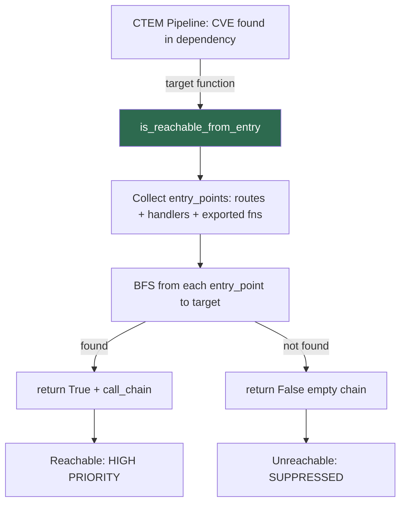

# PRD: Community 453 — CallGraphBuilder.is_reachable_from_entry

## Master Goal Mapping
**ALDECI Pillar**: CTEM — CVE Reachability Determination
**Persona**: Security Engineer, AppSec Lead
**Business Value**: Answers the critical question "Is this vulnerable function actually reachable from a public HTTP endpoint?" enabling suppression of false-positive CVE alerts for unreachable code paths.

## Architecture Diagram


## Code Proof
**File**: `suite-evidence-risk/risk/reachability/call_graph.py:654-675`
```python
@staticmethod
def is_reachable_from_entry(graph: Dict[str, Any], target: str,
                             max_depth: int = 50) -> Tuple[bool, List[str]]:
    entry_points = [
        name for name, node in graph.items()
        if node.get("kind") in ("route", "handler")
        or node.get("is_exported") or node.get("is_public")
    ]
    for ep in entry_points:
        found, chain = CallGraphBuilder._bfs(graph, ep, target, max_depth)
        if found:
            return True, chain
    return False, []
```

## Inter-Dependencies
- **Upstream**: `build_call_graph` builds the graph; `DataFlowAnalyzer` uses reachability result
- **Downstream**: CTEM exploitability verdict, suppression engine
- **Sibling**: `get_entry_points` (Community 454), `get_graph_stats` (Community 455)

## Data Flow
```
build_call_graph(repo_path) → graph dict
  → is_reachable_from_entry(graph, "parse_user_input", max_depth=50)
    → entry_points = [ROUTE:POST:/api/upload, handleRequest, ...]
    → BFS from ROUTE:POST:/api/upload → ... → parse_user_input
    → return (True, [ROUTE:POST:/api/upload, processForm, parse_user_input])
```

## Referenced Docs
- `suite-evidence-risk/risk/reachability/call_graph.py` (lines 654-675)
- OWASP IAST methodology

## Acceptance Criteria
- [ ] Returns (True, chain) when target reachable from any route/handler/exported
- [ ] Returns (False, []) when target unreachable within max_depth
- [ ] max_depth prevents infinite traversal in cyclic graphs
- [ ] Works with Python AST-built and regex-built JS/Go/Java graphs
- [ ] Entry points include kind=route, kind=handler, is_exported=True, is_public=True

## Effort Estimate
**S** — 1 day. Core algorithm complete; integration tests with real repo fixtures.

## Status
**COMPLETE** — Implementation exists. Integration tests needed.
