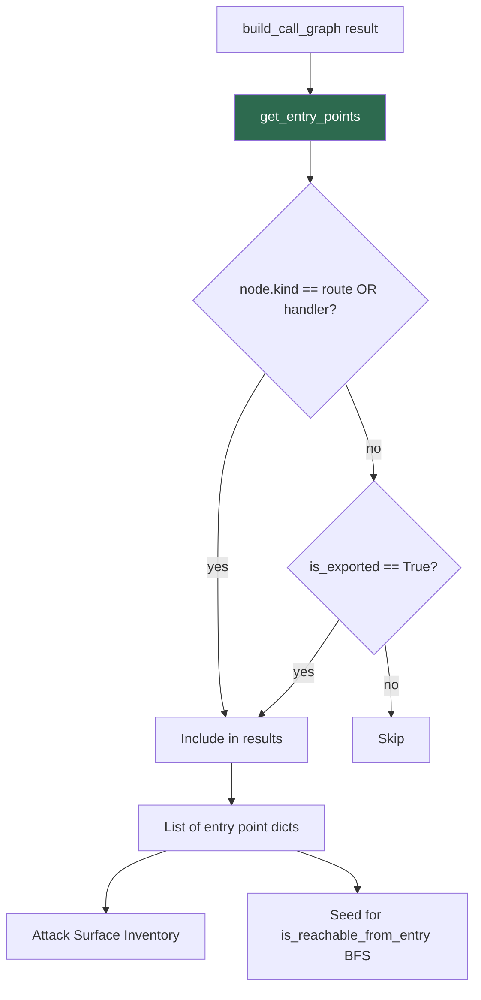

# PRD: Community 454 — CallGraphBuilder.get_entry_points

## Master Goal Mapping
**ALDECI Pillar**: CTEM / Attack Surface Management
**Persona**: AppSec Engineer
**Business Value**: Enumerates all public API entry points in a codebase (routes, handlers, exported functions) to populate the attack surface inventory and seed reachability analysis.

## Architecture Diagram


## Code Proof
**File**: `suite-evidence-risk/risk/reachability/call_graph.py:703-710`
```python
@staticmethod
def get_entry_points(graph: Dict[str, Any]) -> List[Dict[str, Any]]:
    results = []
    for name, node in graph.items():
        if node.get("kind") in ("route", "handler") or node.get("is_exported"):
            results.append({"name": name, **node})
    return results
```

## Inter-Dependencies
- **Upstream**: `build_call_graph` produces the graph
- **Downstream**: `is_reachable_from_entry`, attack surface engine, SBOM export
- **Sibling**: `is_reachable_from_entry` (Community 453), `get_graph_stats` (Community 455)

## Data Flow
```
graph = build_call_graph(repo_path)
  → get_entry_points(graph)
    → filter nodes: kind in {route,handler} OR is_exported=True
    → [{"name": "ROUTE:GET:/api/health", "file": "app.py", "line": 42, ...}, ...]
  → feed to attack surface engine
```

## Referenced Docs
- `suite-evidence-risk/risk/reachability/call_graph.py` (lines 703-710)

## Acceptance Criteria
- [ ] Returns all nodes with kind=route or kind=handler
- [ ] Returns all nodes with is_exported=True
- [ ] Each result dict includes name, file, line, callers, callees
- [ ] Empty graph returns empty list (no error)

## Effort Estimate
**XS** — 0.5 days. Implementation complete; add unit tests.

## Status
**COMPLETE** — Implementation exists. Unit tests needed.
