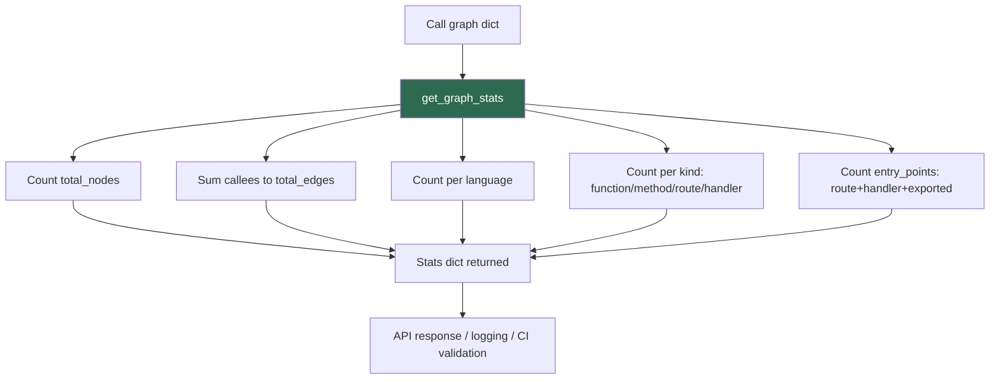

# PRD: Community 455 — CallGraphBuilder.get_graph_stats

## Master Goal Mapping
**ALDECI Pillar**: CTEM — Call Graph Observability
**Persona**: Platform Engineer, Security Architect
**Business Value**: Provides summary statistics (node count, edge count, language distribution, entry points) for call graphs to support capacity planning and graph quality validation.

## Architecture Diagram


## Code Proof
**File**: `suite-evidence-risk/risk/reachability/call_graph.py:712-735`
```python
@staticmethod
def get_graph_stats(graph: Dict[str, Any]) -> Dict[str, Any]:
    languages: Dict[str, int] = {}
    kinds: Dict[str, int] = {}
    for node in graph.values():
        lang = node.get("language", "unknown")
        kind = node.get("kind", "unknown")
        languages[lang] = languages.get(lang, 0) + 1
        kinds[kind] = kinds.get(kind, 0) + 1
    total_edges = sum(len(n.get("callees", [])) for n in graph.values())
    entry_points = sum(1 for n in graph.values()
                       if n.get("kind") in ("route", "handler") or n.get("is_exported"))
    return {"total_nodes": len(graph), "total_edges": total_edges,
            "entry_points": entry_points, "languages": languages, "kinds": kinds}
```

## Inter-Dependencies
- **Upstream**: `build_call_graph` result
- **Downstream**: API stats endpoint, CI quality gate, logging
- **Sibling**: `get_entry_points` (Community 454)

## Data Flow
```
graph dict → get_graph_stats(graph)
  → {"total_nodes": 1842, "total_edges": 6234, "entry_points": 34,
     "languages": {"python": 1200, "javascript": 642},
     "kinds": {"function": 1500, "route": 34, "method": 308}}
```

## Referenced Docs
- `suite-evidence-risk/risk/reachability/call_graph.py` (lines 712-735)

## Acceptance Criteria
- [ ] total_nodes equals len(graph)
- [ ] total_edges is sum of all callees lists
- [ ] entry_points count matches get_entry_points length
- [ ] languages dict populated from node.language field
- [ ] Empty graph returns all counts zero, no KeyError

## Effort Estimate
**XS** — 0.5 days. Implementation complete; add unit tests.

## Status
**COMPLETE** — Implementation exists. Unit tests needed.
