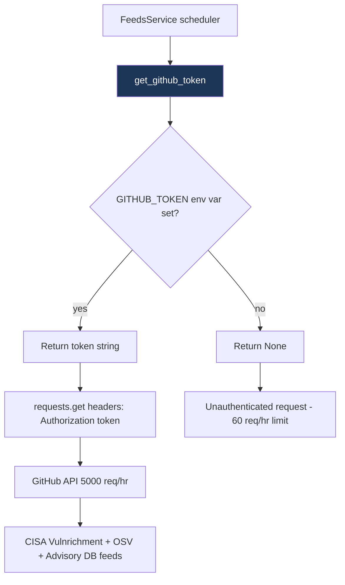

# PRD: Community 456 — feeds_service.get_github_token

## Master Goal Mapping
**ALDECI Pillar**: Threat Intelligence — Feed Ingestion Infrastructure
**Persona**: Platform Engineer
**Business Value**: Retrieves a GitHub API token from the environment to elevate unauthenticated GitHub API rate limits from 60 req/hr to 5,000 req/hr, enabling continuous ingestion of CISA Vulnrichment, GitHub Advisory Database, and OSV feeds without throttling.

## Architecture Diagram


## Code Proof
**File**: `suite-feeds/feeds_service.py`
```python
def get_github_token() -> Optional[str]:
    """Get GitHub API token from environment for higher rate limits."""
    return os.environ.get("GITHUB_TOKEN") or os.environ.get("GH_TOKEN")
```

## Inter-Dependencies
- **Upstream**: Environment variables `GITHUB_TOKEN` / `GH_TOKEN`
- **Downstream**: All GitHub-sourced feed fetchers (CISA Vulnrichment, OSV, Advisory DB)
- **Config**: `suite-core/core/config.py` ALDECIConfig

## Data Flow
```
Feed scheduler tick
  → get_github_token()
    → os.environ.get("GITHUB_TOKEN") → "ghp_xxx..." or None
  → feed_fetcher.headers["Authorization"] = f"token {token}"
  → requests.get(GITHUB_API_URL, headers=headers)
```

## Referenced Docs
- `suite-feeds/feeds_service.py`
- GitHub REST API rate limiting docs

## Acceptance Criteria
- [ ] Returns token when GITHUB_TOKEN set
- [ ] Falls back to GH_TOKEN if GITHUB_TOKEN absent
- [ ] Returns None when neither variable set
- [ ] Token never logged (masked in debug output)
- [ ] Feed fetcher uses token in Authorization header when non-None

## Effort Estimate
**XS** — 0.5 days. Implementation complete; register token per WHAT_TO_BUILD_NEXT item 1.

## Status
**COMPLETE** — Pending API key registration (reminder 2026-04-17).
