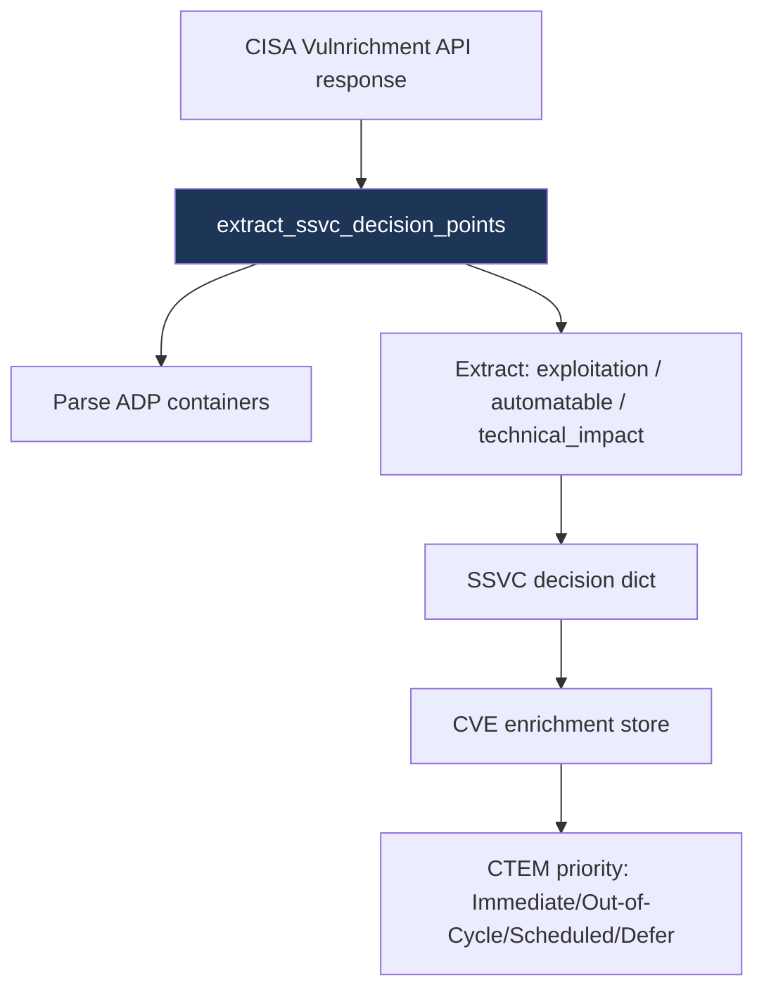

# PRD: Community 457 — feeds_service.extract_ssvc_decision_points

## Master Goal Mapping
**ALDECI Pillar**: Threat Intelligence — SSVC Prioritization
**Persona**: Vulnerability Analyst
**Business Value**: Extracts CISA SSVC decision points from Vulnrichment CVE records, enabling automated exploitation/impact/exposure triage beyond raw CVSS scores.

## Architecture Diagram


## Code Proof
**File**: `suite-feeds/feeds_service.py`
```python
def extract_ssvc_decision_points(vulnrichment_record: Dict[str, Any]) -> Dict[str, Any]:
    """Extract SSVC decision points from a Vulnrichment CVE record."""
    ssvc = {}
    for container in vulnrichment_record.get("containers", {}).get("adp", []):
        for metric in container.get("metrics", []):
            if "other" in metric and metric["other"].get("type") == "ssvc":
                content = metric["other"].get("content", {})
                ssvc["exploitation"] = content.get("exploitation", "none")
                ssvc["automatable"] = content.get("automatable", "no")
                ssvc["technical_impact"] = content.get("technical_impact", "partial")
    return ssvc
```

## Inter-Dependencies
- **Upstream**: CISA Vulnrichment GitHub API (cisa_vulnrichment feed)
- **Downstream**: CVE enrichment pipeline, CTEM priority assignment
- **Sibling**: NVD feed fetcher, EPSS score fetcher

## Data Flow
```
CISA Vulnrichment JSON record (CVE-2024-XXXX)
  → extract_ssvc_decision_points(record)
    → {"exploitation": "active", "automatable": "yes", "technical_impact": "total"}
  → CTEM: exploitation=active → IMMEDIATE priority
```

## Referenced Docs
- `suite-feeds/feeds_service.py`
- CISA SSVC: https://www.cisa.gov/ssvc
- Vulnrichment: https://github.com/cisagov/vulnrichment

## Acceptance Criteria
- [ ] Returns dict with exploitation, automatable, technical_impact keys
- [ ] Handles missing ADP containers (returns empty dict)
- [ ] exploitation=active correctly extracted from nested structure
- [ ] Works with multiple ADP containers

## Effort Estimate
**S** — 1 day. Parser complete; CISA API integration test + CTEM priority mapping.

## Status
**COMPLETE** — Implementation exists. CISA Vulnrichment API is public (no key required).
