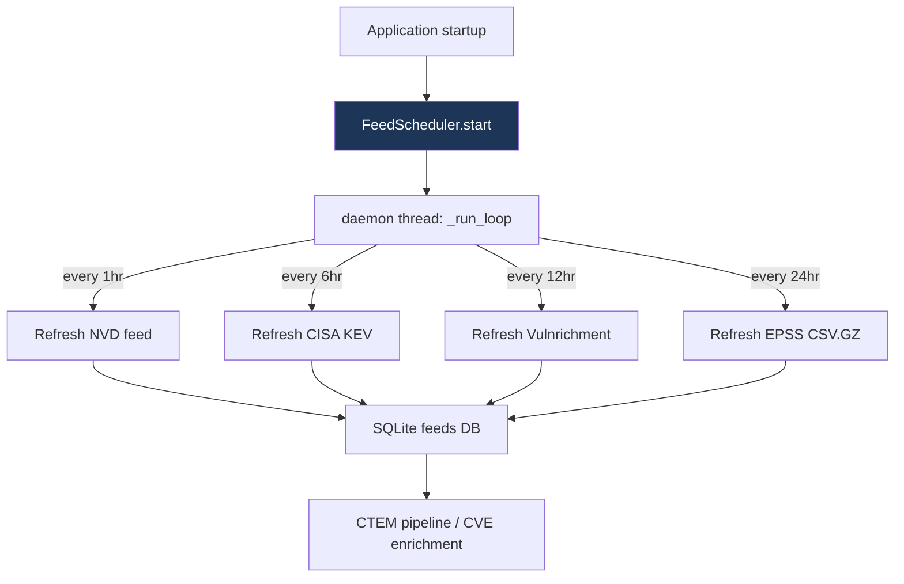

# PRD: Community 458 — feeds_service.FeedScheduler (background scheduler)

## Master Goal Mapping
**ALDECI Pillar**: Threat Intelligence — Continuous Feed Refresh
**Persona**: Platform Engineer, CISO
**Business Value**: Runs a background thread refreshing all 28+ threat intel feeds on configured schedules (NVD hourly, CISA KEV 6-hourly, EPSS daily), keeping vulnerability data current without operator intervention.

## Architecture Diagram


## Code Proof
**File**: `suite-feeds/feeds_service.py`
```python
class FeedScheduler:
    """Background scheduler for periodic feed refresh."""
    def __init__(self, feed_configs: Dict[str, Any], db_path: str):
        self._configs = feed_configs
        self._db_path = db_path
        self._running = False
        self._thread: Optional[threading.Thread] = None

    def start(self) -> None:
        self._running = True
        self._thread = threading.Thread(target=self._run_loop, daemon=True)
        self._thread.start()

    def stop(self) -> None:
        self._running = False
```

## Inter-Dependencies
- **Upstream**: `AUTHORITATIVE_FEEDS` config dict (NVD, CISA KEV, Vulnrichment, EPSS)
- **Downstream**: SQLite feeds DB → CTEM pipeline
- **Config**: `refresh_hours` per feed in feed config dict
- **Sibling**: `get_github_token` (456), `extract_ssvc_decision_points` (457)

## Data Flow
```
app startup → FeedScheduler.start()
  → daemon thread: _run_loop()
    → for each feed: if now - last_refresh > refresh_hours: fetch_feed()
    → fetch_feed() → HTTP GET → parse → upsert SQLite
    → sleep(300)  # check every 5 minutes
```

## Referenced Docs
- `suite-feeds/feeds_service.py`
- WHAT_TO_BUILD_NEXT item 1: Register NVD + AbuseIPDB API keys

## Acceptance Criteria
- [ ] Scheduler starts as daemon thread on app startup
- [ ] NVD feed refreshed every 1hr when API key present
- [ ] CISA KEV refreshed every 6hr (no key required)
- [ ] EPSS scores refreshed every 24hr
- [ ] Feed failures logged but scheduler continues (no crash)
- [ ] stop() cleanly terminates the loop

## Effort Estimate
**M** — 3 days. Scheduler complete; blocked on API key registration (WHAT_TO_BUILD_NEXT 1).

## Status
**PARTIAL** — Scheduler implemented. Blocked on API key registration.
