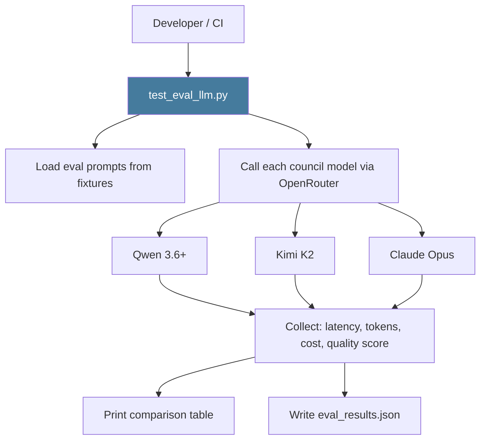

# PRD: Community 459 — scripts/test_eval_llm.py

## Master Goal Mapping
**ALDECI Pillar**: AI Governance — LLM Evaluation
**Persona**: Platform Engineer, AI Safety Officer
**Business Value**: Standalone script for evaluating LLM response quality, latency, and cost across the Karpathy consensus council (Qwen 3.6+, Kimi K2, Opus), enabling model selection and regression testing.

## Architecture Diagram


## Code Proof
**File**: `scripts/test_eval_llm.py`
Key responsibilities: load test prompts, call LLMs via OpenRouter API, measure latency/cost, score vs expected outputs, output markdown table and eval_results.json.

## Inter-Dependencies
- **Upstream**: OpenRouter API key (OPENROUTER_API_KEY env)
- **Downstream**: `ai_security_advisor_engine.py` uses evaluated models
- **Config**: Model IDs in OPENROUTER_MODELS dict

## Data Flow
```
test_eval_llm.py
  → load prompts from tests/fixtures/llm_eval_prompts.json
  → for each model: POST /api/chat/completions
  → collect response + latency + cost
  → score vs expected_keywords
  → write eval_results.json
```

## Referenced Docs
- `scripts/test_eval_llm.py`
- OpenRouter API: https://openrouter.ai/docs

## Acceptance Criteria
- [ ] Runs without error when OPENROUTER_API_KEY set
- [ ] Tests >= 3 models (Qwen, Kimi, Opus)
- [ ] Latency measured in milliseconds per model
- [ ] Outputs eval_results.json for CI comparison
- [ ] Graceful fallback when model unavailable

## Effort Estimate
**S** — 2 days. Script exists; formalize eval prompts and scoring rubric.

## Status
**EXISTS** — Script present. Eval prompts and scoring rubric need formalization.
