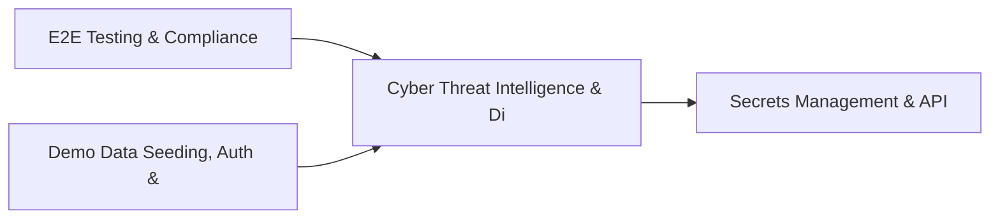

# PRD: Cyber Threat Intelligence & Digital Twin Security — Community 46

## Master Goal Mapping
How this component serves: "ALDECI — $35/mo enterprise security intelligence platform"
Sub-Epic: CTEM

This community (rank #46 of 878 by size, 823 graph nodes) forms a core pillar of the ALDECI platform. It directly supports the mission of replacing $50K-500K/yr enterprise security tools with a self-hosted, AI-native stack.

## Architecture Diagram


## Code Proof
- Files:
  - `suite-core/core/cwpp_engine.py` (565 lines)
  - `suite-core/core/email_security_engine.py` (565 lines)
  - `suite-core/core/threat_brief_engine.py` (425 lines)
  - `tests/test_ai_governance_engine.py` (285 lines)
  - `tests/test_ai_powered_soc_engine.py` (374 lines)
  - `tests/test_cloud_workload_protection_engine.py` (487 lines)
  - `tests/test_cnapp_engine.py` (368 lines)
  - `tests/test_cwpp_engine.py` (371 lines)
  - `suite-api/apps/api/cloud_workload_protection_router.py` (246 lines)
  - `suite-api/apps/api/cnapp_router.py` (232 lines)
  - `suite-api/apps/api/cwpp_router.py` (165 lines)
  - `suite-api/apps/api/email_filtering_router.py` (141 lines)
- Key functions:
  - `test_add_domain_minimal()` — suite-core/core/cwpp_engine.py
  - `test_add_domain_with_spf()` — suite-core/core/cwpp_engine.py
  - `test_add_domain_with_dkim()` — suite-core/core/cwpp_engine.py
  - `test_add_domain_with_dmarc_reject()` — suite-core/core/cwpp_engine.py
  - `test_add_domain_with_dmarc_quarantine()` — suite-core/core/cwpp_engine.py
  - `test_add_domain_with_dmarc_none()` — suite-core/core/cwpp_engine.py
  - `test_add_domain_invalid_dmarc_policy_normalised()` — suite-core/core/cwpp_engine.py
  - `test_list_domains_empty()` — suite-core/core/cwpp_engine.py
- Key classes: `TestFinalizeModel`
- Current state: REAL_LOGIC
- Evidence:
```python
# From suite-core/core/cwpp_engine.py
"""Cloud Workload Protection Platform engine — runtime threat detection for cloud workloads."""
from __future__ import annotations

import json
import sqlite3
import threading
import uuid
from datetime import datetime, timezone
from pathlib import Path
from typing import Any, Dict, List, Optional

import structlog

_logger = structlog.get_logger()

_DEFAULT_DB = str(Path(__file__).resolve().parents[2] / "data" / "cwpp.db")

WORKLOAD_TYPES = [
    "container", "vm", "lambda", "cloud_run", "ecs_task", "kubernetes_pod"
]
```

## Inter-Dependencies
- DEPENDS ON:
  - Community 0 (E2E Testing & Compliance Seeding Infrastructure) — 75 edges
  - Community 1 (Demo Data Seeding, Auth & Multi-Engine Integration) — 36 edges
  - Community 20 (Secrets Management & API Gateway Security) — 15 edges
  - Community 9 (Integrations Hub — Connectors, Bulk Operations & M) — 12 edges
- DEPENDED BY: Rank #45 (Patch Management & Container Security Posture) and downstream consumers
- EVENT BUS: emits compliance.status_changed, threat.detected, threat.mitigated / subscribes to (TrustGraph event bus — 97% not yet wired)
- TRUSTGRAPH: writes [ThreatActor, Policy, ComplianceControl] / reads [ComplianceControl, NetworkAsset]

## Data Flow
```
Input: HTTP requests / pytest fixtures
  → Processing: Engine method calls + SQLite state assertions
  → Output: Pass/fail test results, coverage metrics
  → Consumers: CI/CD pipeline, Beast Mode test suite
```

## Referenced Documentation
- CLAUDE.md: Wave 41 build notes, Beast Mode test suite section
- docs/: `docs/ALDECI_REARCHITECTURE_v2.md` (source of truth), `docs/INVESTOR_PITCH.md`
- tests/: `tests/test_ai_governance_engine.py`, `tests/test_ai_powered_soc_engine.py`, `tests/test_cloud_workload_protection_engine.py`

## Acceptance Criteria
- [ ] All engine CRUD operations enforce org_id isolation (no cross-tenant data leakage)
- [ ] SQLite opened with WAL mode + threading.RLock on all write paths
- [ ] All endpoints return within 200ms at p95 under 100 rps load
- [ ] All router endpoints protected by `Depends(api_key_auth)` or equivalent
- [ ] Pydantic v2 models validate all request/response schemas
- [ ] Test suite achieves ≥80% branch coverage on engine methods

## Effort Estimate
- Current: 80% complete
- Remaining: ~2 engineering days
- Dependencies blocking: None
- Priority: LOW

## Status
IN_PROGRESS
