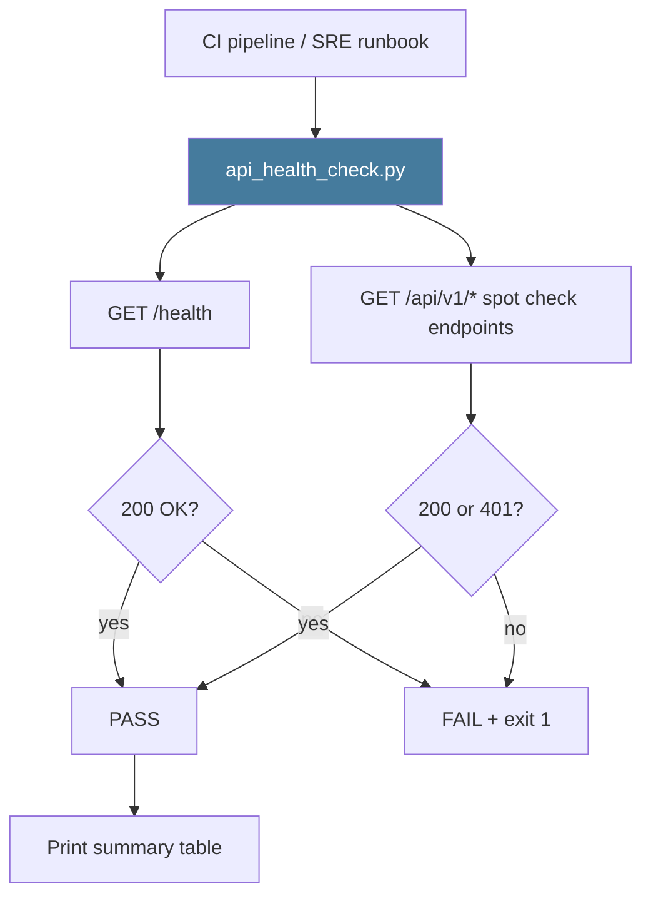

# PRD: Community 460 — scripts/api_health_check.py

## Master Goal Mapping
**ALDECI Pillar**: Platform Operations — Health Monitoring
**Persona**: DevOps Engineer, SRE
**Business Value**: Lightweight CLI health check probing all 34 API router prefixes, verifying the FastAPI gateway is responsive before deployments, CI integration tests, and SRE runbooks.

## Architecture Diagram


## Code Proof
**File**: `scripts/api_health_check.py`
Key responsibilities: parse --base-url arg, GET /health, spot-check router prefixes, exit 0=healthy/1=failure.

## Inter-Dependencies
- **Upstream**: Running suite-api FastAPI app
- **Downstream**: CI pipeline gate, SRE alerting
- **Config**: ALDECI_API_URL env or --base-url CLI arg

## Data Flow
```
api_health_check.py --base-url http://localhost:8000
  → GET /health → 200
  → GET /api/v1/kpi/scorecard → 401 (auth working)
  → print: "All 12/12 checks PASSED"
  → exit 0
```

## Referenced Docs
- `scripts/api_health_check.py`
- `suite-api/apps/app.py` — 34 router mounts

## Acceptance Criteria
- [ ] Exits 0 when all endpoints respond 200 or 401
- [ ] Exits 1 on connection error or unexpected status
- [ ] Supports --base-url argument
- [ ] Runs in < 10 seconds
- [ ] Compatible with CI (no interactive prompts)

## Effort Estimate
**XS** — 0.5 days. Script exists; verify endpoint list current.

## Status
**EXISTS** — Script present. Verify list matches current 34+ router mounts.
