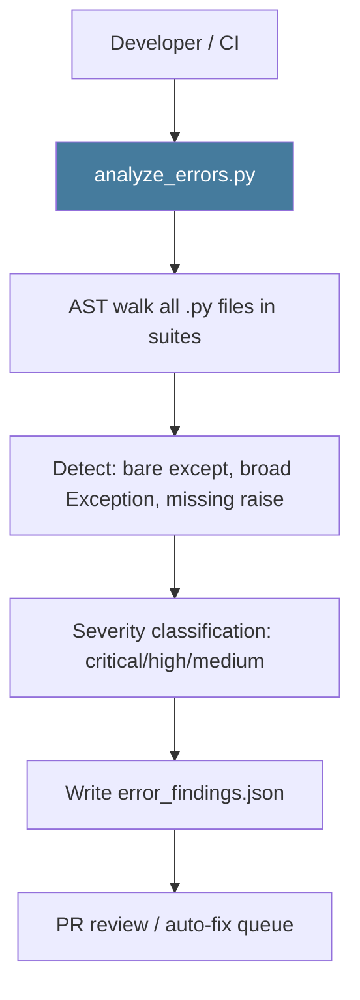

# PRD: Community 461 — scripts/analyze_errors.py

## Master Goal Mapping
**ALDECI Pillar**: Platform Operations — Error Pattern Analysis
**Persona**: DevOps Engineer, Platform Engineer
**Business Value**: AST-based static analyzer scanning for bare except clauses, broad Exception catches, and missing error handling — producing a prioritized findings report. Used in Wave 6: 652 findings, 6 critical fixed.

## Architecture Diagram


## Code Proof
**File**: `scripts/analyze_errors.py`
Key responsibilities: ast.walk() all Python files, detect ExceptHandler with no type (bare except), detect pass-only except blocks, output structured JSON.

## Inter-Dependencies
- **Upstream**: Python AST module (stdlib)
- **Downstream**: Error hardening fixes (Wave 6), CI quality gate
- **Sibling**: `bulk_autofix_benchmark.py` (Community 468)

## Data Flow
```
analyze_errors.py suite-core/ suite-api/ suite-feeds/
  → ast.parse each .py file
  → walk ExceptHandler nodes
  → classify: bare_except / broad_exception / silent_pass
  → write error_findings.json
  → print: "652 findings: 6 critical, 124 high, 522 medium"
```

## Referenced Docs
- `scripts/analyze_errors.py`
- CLAUDE.md DONE: "Error handling auditor (AST-based, 652 findings, fixed top 6 critical)"

## Acceptance Criteria
- [ ] Detects bare except: clauses (severity: critical)
- [ ] Detects except Exception: with only pass (severity: high)
- [ ] Outputs valid JSON with file, line, type, severity
- [ ] CI exits non-zero if critical findings > 0

## Effort Estimate
**XS** — 0.5 days. Script exists and was used in Wave 6. Wire as CI gate.

## Status
**COMPLETE** — Used in Wave 6. Wire as CI quality gate to prevent regressions.
