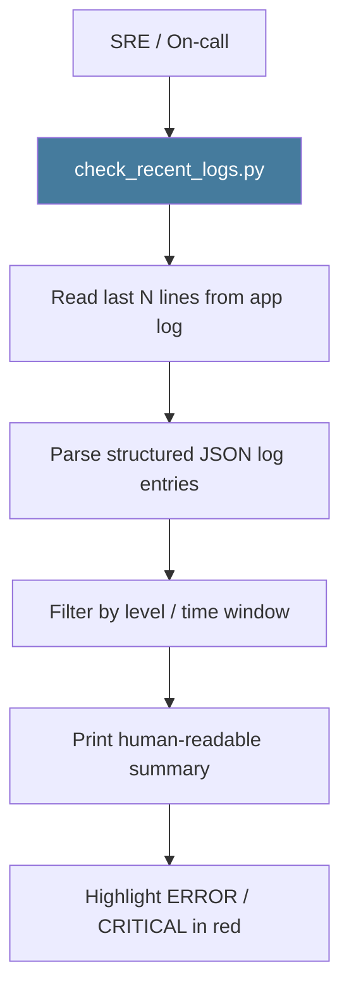

# PRD: Community 462 — scripts/check_recent_logs.py

## Master Goal Mapping
**ALDECI Pillar**: Platform Operations — Live Log Monitoring
**Persona**: SRE, DevOps Engineer
**Business Value**: Quick CLI tool to tail and filter recent structured logs from ALDECI, enabling rapid incident diagnosis without requiring full ELK/Grafana stack access.

## Architecture Diagram


## Code Proof
**File**: `scripts/check_recent_logs.py`
Key: reads structlog JSON lines, filters last N minutes, highlights ERROR/CRITICAL, counts by level.

## Inter-Dependencies
- **Upstream**: structlog JSON output from suite-api FastAPI app
- **Downstream**: On-call runbook, incident triage
- **Sibling**: `check_logs_now.py` (463), `deep_log_analysis.py` (464)

## Data Flow
```
check_recent_logs.py --minutes 30 --level ERROR
  → read last 30min from app.log
  → parse JSON: {level, event, timestamp}
  → filter level >= ERROR
  → print: "Found 3 ERROR, 1 CRITICAL in last 30 minutes"
```

## Referenced Docs
- `scripts/check_recent_logs.py`

## Acceptance Criteria
- [ ] Reads last N minutes of logs (configurable)
- [ ] Filters by log level
- [ ] Parses structlog JSON format
- [ ] Highlights ERROR/CRITICAL entries
- [ ] Works without external dependencies (stdlib only)

## Effort Estimate
**XS** — 0.5 days. Script exists; verify log path and format compatibility.

## Status
**EXISTS** — Script present. Verify compatibility with current structlog format.
