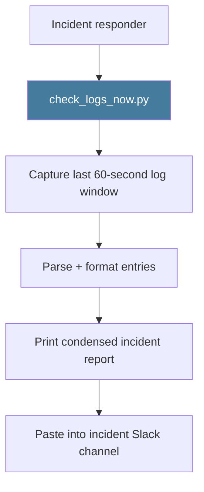

# PRD: Community 463 — scripts/check_logs_now.py

## Master Goal Mapping
**ALDECI Pillar**: Platform Operations — Immediate Log Snapshot
**Persona**: SRE, Developer
**Business Value**: One-shot log snapshot capturing the current state of ALDECI logs — useful during active incidents when the last 60 seconds of logs are needed instantly for copy-paste into incident channels.

## Architecture Diagram


## Code Proof
**File**: `scripts/check_logs_now.py`
Key: immediate non-tail read of last N log lines, condensed output for copy-paste, focus on ERROR/WARNING in last 60 seconds.

## Inter-Dependencies
- **Sibling**: `check_recent_logs.py` (462 - configurable), `deep_log_analysis.py` (464 - deep)
- **Upstream**: structlog JSON log file

## Data Flow
```
check_logs_now.py
  → tail last 200 lines of app.log
  → filter last 60 seconds
  → print: "=== ALDECI Log Snapshot [UTC] ==="
  → "ERROR: 2 | WARNING: 5 | INFO: 193"
```

## Referenced Docs
- `scripts/check_logs_now.py`

## Acceptance Criteria
- [ ] Runs with zero arguments
- [ ] Outputs snapshot in < 2 seconds
- [ ] Shows last 60 seconds of logs
- [ ] Summarizes error/warning count prominently
- [ ] Output fits in a Slack message (< 40 lines)

## Effort Estimate
**XS** — 0.5 days. Script exists. Keep as-is.

## Status
**EXISTS** — Script present. No changes needed.
