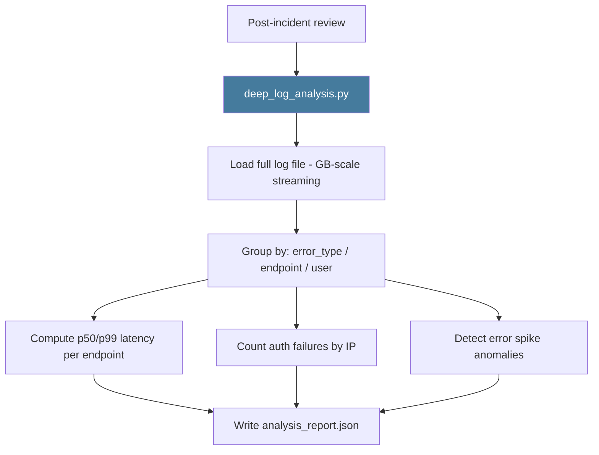

# PRD: Community 464 — scripts/deep_log_analysis.py

## Master Goal Mapping
**ALDECI Pillar**: Platform Operations — Advanced Log Analytics
**Persona**: Platform Engineer, Security Analyst
**Business Value**: Deep pattern analysis on ALDECI logs — identifying recurring error patterns, slow endpoints (p99 latency), auth failures by IP, and anomalous volumes — used for post-incident reviews and capacity planning.

## Architecture Diagram


## Code Proof
**File**: `scripts/deep_log_analysis.py`
Key: stream-parse large log files, aggregate by error frequency and endpoint latency, detect spikes, output JSON + optional HTML.

## Inter-Dependencies
- **Upstream**: structlog JSON log file
- **Downstream**: Post-incident report, capacity planning, security audit
- **Sibling**: `check_recent_logs.py` (live), `check_logs_now.py` (snapshot)

## Data Flow
```
deep_log_analysis.py --log-file app.log --from "2026-04-15"
  → stream parse log lines
  → aggregate: endpoint latency histograms, error type counts
  → detect: auth_failures by IP (top 10)
  → write deep_analysis_report.json
```

## Referenced Docs
- `scripts/deep_log_analysis.py`

## Acceptance Criteria
- [ ] Handles log files > 1GB via streaming (no OOM)
- [ ] Reports p50/p99 latency per endpoint
- [ ] Lists top-10 error types by frequency
- [ ] Lists top-10 IPs by auth failure count
- [ ] Outputs valid JSON report

## Effort Estimate
**S** — 2 days. Script exists; verify streaming behavior and output format.

## Status
**EXISTS** — Script present. Verify handles large log files without OOM.
