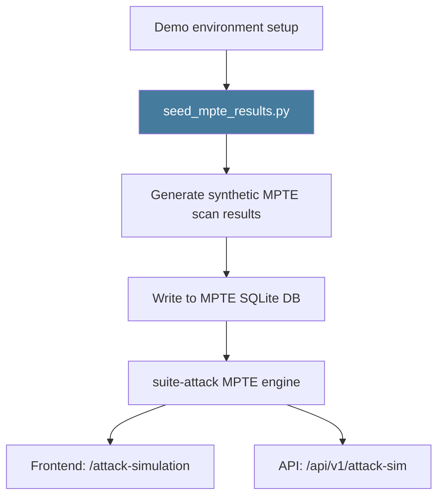

# PRD: Community 465 — scripts/seed_mpte_results.py

## Master Goal Mapping
**ALDECI Pillar**: MPTE — Demo Data Seeding
**Persona**: Sales Engineer, Developer
**Business Value**: Seeds the MPTE database with realistic pentest/attack simulation results for demo environments, enabling investor-quality demonstrations without requiring live target systems.

## Architecture Diagram


## Code Proof
**File**: `scripts/seed_mpte_results.py`
Key: generates realistic attack results with MITRE ATT&CK mappings, inserts to MPTE SQLite, covers web/API/cloud/network target types.

## Inter-Dependencies
- **Downstream**: suite-attack MPTE engine, /api/v1/attack-sim router
- **Sibling**: `fix_mpte_random.py` (Community 479)
- **Frontend**: /attack-simulation page

## Data Flow
```
seed_mpte_results.py --org-id demo-org --count 50
  → generate 50 synthetic attack results
  → INSERT into mpte_results SQLite table
  → print: "Seeded 50 MPTE results for demo-org"
```

## Referenced Docs
- `scripts/seed_mpte_results.py`
- CLAUDE.md: "Demo data seeder (10 engines, investor-quality)"

## Acceptance Criteria
- [ ] Seeds >= 20 MPTE results per run
- [ ] Results span multiple attack categories
- [ ] MITRE ATT&CK techniques included
- [ ] Idempotent (re-run does not duplicate)
- [ ] Compatible with demo environment setup

## Effort Estimate
**XS** — 0.5 days. Script exists; verify MPTE DB schema compatibility.

## Status
**EXISTS** — Script present. Verify schema compatibility after MPTE engine updates.
