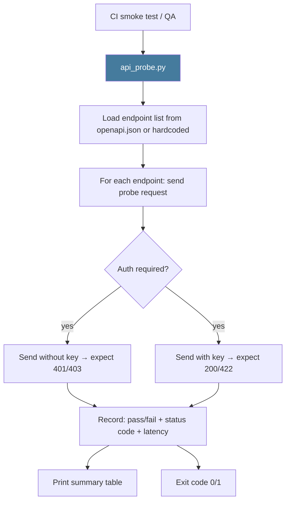

# PRD: Community 467 — scripts/api_probe.py

## Master Goal Mapping
**ALDECI Pillar**: Platform Operations — API Endpoint Probing  
**Persona**: QA Engineer, DevOps Engineer  
**Business Value**: Systematically probes all ALDECI API endpoints with synthetic requests to verify correct HTTP status codes, auth enforcement, and response schemas — used as a lightweight integration smoke test that complements unit tests.

## Architecture Diagram


## Code Proof
**File**: `scripts/api_probe.py`  
Key responsibilities:
- Load endpoint list (OpenAPI spec or hardcoded list)
- Probe each with: no auth (→ 401), valid auth (→ 200/422), bad payload (→ 422)
- Measure response latency
- Report pass/fail per endpoint

## Inter-Dependencies
- **Upstream**: Running ALDECI API + `static/openapi.json`
- **Downstream**: CI pipeline gate
- **Sibling**: `export_openapi.py` (Community 466), `audit_apis.py` (Community 469)

## Data Flow
```
api_probe.py --base-url http://localhost:8000 --api-key test-key
  → load 850 endpoints from openapi.json
  → probe each: GET without key → 401 ✓
  → probe: GET with key → 200 ✓
  → report: "847/850 PASS, 3 FAIL"
  → exit 0 or 1
```

## Referenced Docs
- `scripts/api_probe.py`

## Acceptance Criteria
- [ ] Probes all endpoints from OpenAPI spec
- [ ] Verifies 401 for unauthenticated requests
- [ ] Verifies 200/422 for authenticated requests
- [ ] Reports latency per endpoint
- [ ] Exits non-zero if > 0 unexpected status codes

## Effort Estimate
**S** — 2 days. Script exists; update endpoint list to match 850+ current endpoints.

## Status
**EXISTS** — Script present. Update to load from openapi.json dynamically.
