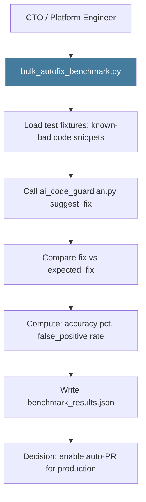

# PRD: Community 468 — scripts/bulk_autofix_benchmark.py

## Master Goal Mapping
**ALDECI Pillar**: AI Code Quality — Auto-Fix Benchmarking  
**Persona**: Platform Engineer, CTO  
**Business Value**: Benchmarks the AI-powered auto-fix capability against known error patterns, measuring fix accuracy and false-positive rate — used to evaluate the `ai_code_guardian.py` engine before enabling auto-PR creation for production code fixes.

## Architecture Diagram


## Code Proof
**File**: `scripts/bulk_autofix_benchmark.py`  
Key responsibilities:
- Load fixture files: pairs of (bad_code, expected_fix)
- Call `ai_code_guardian` suggest_fix on each
- Score: exact match / semantic equivalence / wrong fix / false positive
- Compute accuracy%, false_positive_rate%, latency

## Inter-Dependencies
- **Upstream**: `suite-core/core/ai_code_guardian.py` (fix suggestion engine)
- **Downstream**: Auto-PR creation gate
- **Sibling**: `analyze_errors.py` (Community 461 — finds errors to fix)

## Data Flow
```
bulk_autofix_benchmark.py --fixtures tests/fixtures/autofix/
  → load 100 (bad_code, expected_fix) pairs
  → for each: ai_code_guardian.suggest_fix(bad_code)
  → score: 87 exact/semantic match, 8 wrong, 5 false positive
  → accuracy: 87%, FP rate: 5%
  → write benchmark_results.json
```

## Referenced Docs
- `scripts/bulk_autofix_benchmark.py`
- `suite-core/core/ai_code_guardian.py`

## Acceptance Criteria
- [ ] Processes ≥ 50 benchmark fixtures
- [ ] Reports accuracy % and false positive rate
- [ ] Benchmark fixtures cover: bare except, SQL injection, path traversal
- [ ] Results reproducible (deterministic model temperature=0)
- [ ] Threshold: accuracy ≥ 85% before enabling auto-PR

## Effort Estimate
**M** — 3 days. Script exists; create benchmark fixture library.

## Status
**EXISTS** — Script present. Benchmark fixture library needs creation.
