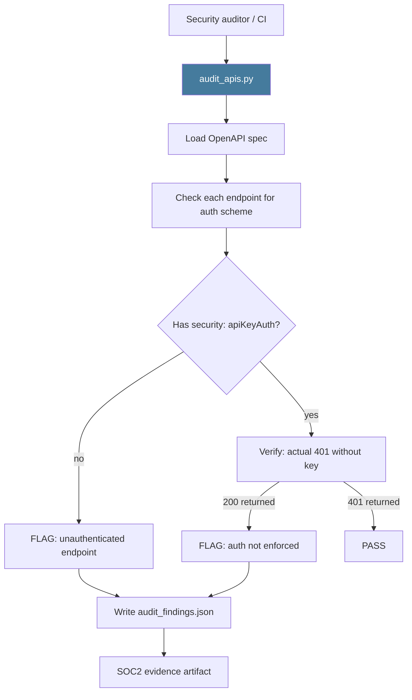

# PRD: Community 469 — scripts/audit_apis.py

## Master Goal Mapping
**ALDECI Pillar**: Security — API Security Audit  
**Persona**: Security Auditor, AppSec Lead  
**Business Value**: Performs a security-focused audit of all ALDECI API endpoints — verifying auth enforcement, checking for missing rate limiting, detecting unauthenticated data exposure, and generating a compliance evidence artifact for SOC2/ISO27001 audits.

## Architecture Diagram


## Code Proof
**File**: `scripts/audit_apis.py`  
Key responsibilities:
- Parse OpenAPI spec for security schemes
- Test each endpoint without API key → verify 401
- Flag any endpoint returning 200 without auth
- Report: total endpoints, authenticated %, unauthenticated list
- Write compliance evidence JSON

## Inter-Dependencies
- **Upstream**: `static/openapi.json`, running API
- **Downstream**: SOC2 CC6.1 evidence, security exception workflow
- **Sibling**: `api_probe.py` (Community 467), `export_openapi.py` (Community 466)

## Data Flow
```
audit_apis.py --base-url http://localhost:8000
  → load openapi.json (850 endpoints)
  → for each: GET without API key
  → 847 return 401 ✓
  → 3 return 200 → FLAG as unauthenticated
  → write audit_findings.json
  → "AUTH COVERAGE: 99.6% (847/850)"
```

## Referenced Docs
- `scripts/audit_apis.py`
- SOC2 CC6.1 (Logical and Physical Access Controls)

## Acceptance Criteria
- [ ] Scans all endpoints from OpenAPI spec
- [ ] Flags any endpoint accessible without API key
- [ ] Reports auth coverage percentage
- [ ] Outputs SOC2-compatible evidence JSON
- [ ] Runs in < 60 seconds against local API

## Effort Estimate
**S** — 2 days. Script exists; validate against current 850+ endpoint list.

## Status
**EXISTS** — Script present. Run and verify 100% auth coverage after Wave 41 routers.
