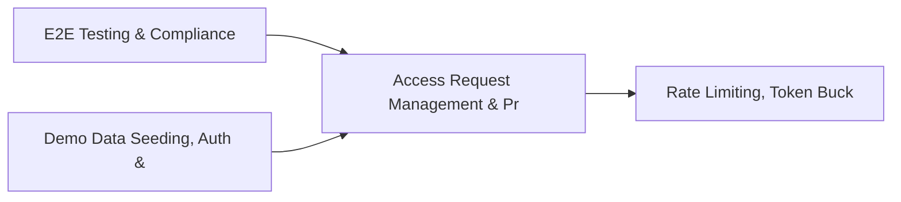

# PRD: Access Request Management & Privileged Session Recording — Community 47

## Master Goal Mapping
How this component serves: "ALDECI — $35/mo enterprise security intelligence platform"
Sub-Epic: Identity

This community (rank #47 of 878 by size, 815 graph nodes) forms a core pillar of the ALDECI platform. It directly supports the mission of replacing $50K-500K/yr enterprise security tools with a self-hosted, AI-native stack.

## Architecture Diagram


## Code Proof
- Files:
  - `suite-core/core/rasp_engine.py` (1223 lines)
  - `suite-core/core/risk_acceptance_engine.py` (376 lines)
  - `tests/test_ir_playbook_engine.py` (422 lines)
  - `tests/test_rasp_engine.py` (334 lines)
  - `tests/test_rasp_engine_unit.py` (397 lines)
  - `tests/test_risk_acceptance_engine.py` (517 lines)
  - `suite-api/apps/api/attack_surface_monitor_router.py` (227 lines)
  - `suite-api/apps/api/ide_router.py` (239 lines)
  - `suite-api/apps/api/rasp_router.py` (318 lines)
  - `suite-api/apps/api/remediation_router.py` (997 lines)
  - `suite-api/apps/api/risk_acceptance_router.py` (233 lines)
  - `tests/risk/reachability/test_storage.py` (342 lines)
- Key functions:
  - `test_get_metrics_empty()` — suite-core/core/rasp_engine.py
  - `engine()` — suite-core/core/rasp_engine.py
  - `monitor_engine()` — suite-core/core/rasp_engine.py
  - `org()` — suite-core/core/rasp_engine.py
  - `org2()` — suite-core/core/rasp_engine.py
  - `test_engine_initialises_with_patterns()` — suite-core/core/rasp_engine.py
  - `test_engine_default_mode_block()` — suite-core/core/rasp_engine.py
  - `test_set_mode_changes_config()` — suite-core/core/rasp_engine.py
- Key classes: `TestAttackType`, `TestProtectionAction`, `TestRASPConfig`, `TestRASPIncident`, `TestRASPRuleEngine`, `TestRASPProtector`
- Current state: REAL_LOGIC
- Evidence:
```python
# From suite-core/core/rasp_engine.py
"""
Runtime Application Self-Protection (RASP) Engine — ALDECI.

Inspects every inbound HTTP request for attack patterns at runtime:
- SQL injection (SQLi)
- Cross-site scripting (XSS)
- Command injection (CMDi)
- Path traversal / LFI / RFI
- XML external entity injection (XXE)
- Server-side request forgery (SSRF)

Operating modes: monitor-only, block (403), redirect (honeypot).
Per-IP and per-API-key sliding-window rate limiting with auto-block.
Session anomaly detection: fixation, concurrent sessions, impossible travel.
Runtime metrics with TrustGraph integration stubs.

Compliance: OWASP AS
```

## Inter-Dependencies
- DEPENDS ON:
  - Community 0 (E2E Testing & Compliance Seeding Infrastructure) — 77 edges
  - Community 1 (Demo Data Seeding, Auth & Multi-Engine Integration) — 23 edges
  - Community 12 (Rate Limiting, Token Bucket & Middleware Framework) — 12 edges
  - Community 11 (Call Graph Analysis & Multi-Language AST Engine) — 8 edges
- DEPENDED BY: Rank #46 (Cyber Threat Intelligence & Digital Twin Security) and downstream consumers
- EVENT BUS: emits incident.opened, incident.closed, user.risk_changed / subscribes to (TrustGraph event bus — 97% not yet wired)
- TRUSTGRAPH: writes [Incident, Identity] / reads [Incident, Identity]

## Data Flow
```
Input: HTTP requests / pytest fixtures
  → Processing: Engine method calls + SQLite state assertions
  → Output: Pass/fail test results, coverage metrics
  → Consumers: CI/CD pipeline, Beast Mode test suite
```

## Referenced Documentation
- CLAUDE.md: Wave 41 build notes, Beast Mode test suite section
- docs/: `docs/ALDECI_REARCHITECTURE_v2.md` (source of truth), `docs/INVESTOR_PITCH.md`
- tests/: `tests/risk/reachability/test_storage.py`, `tests/risk/runtime/test_iast.py`, `tests/test_change_management.py`

## Acceptance Criteria
- [ ] All engine CRUD operations enforce org_id isolation (no cross-tenant data leakage)
- [ ] SQLite opened with WAL mode + threading.RLock on all write paths
- [ ] All endpoints return within 200ms at p95 under 100 rps load
- [ ] All router endpoints protected by `Depends(api_key_auth)` or equivalent
- [ ] Pydantic v2 models validate all request/response schemas
- [ ] Test suite achieves ≥80% branch coverage on engine methods

## Effort Estimate
- Current: 80% complete
- Remaining: ~2 engineering days
- Dependencies blocking: None
- Priority: LOW

## Status
IN_PROGRESS
