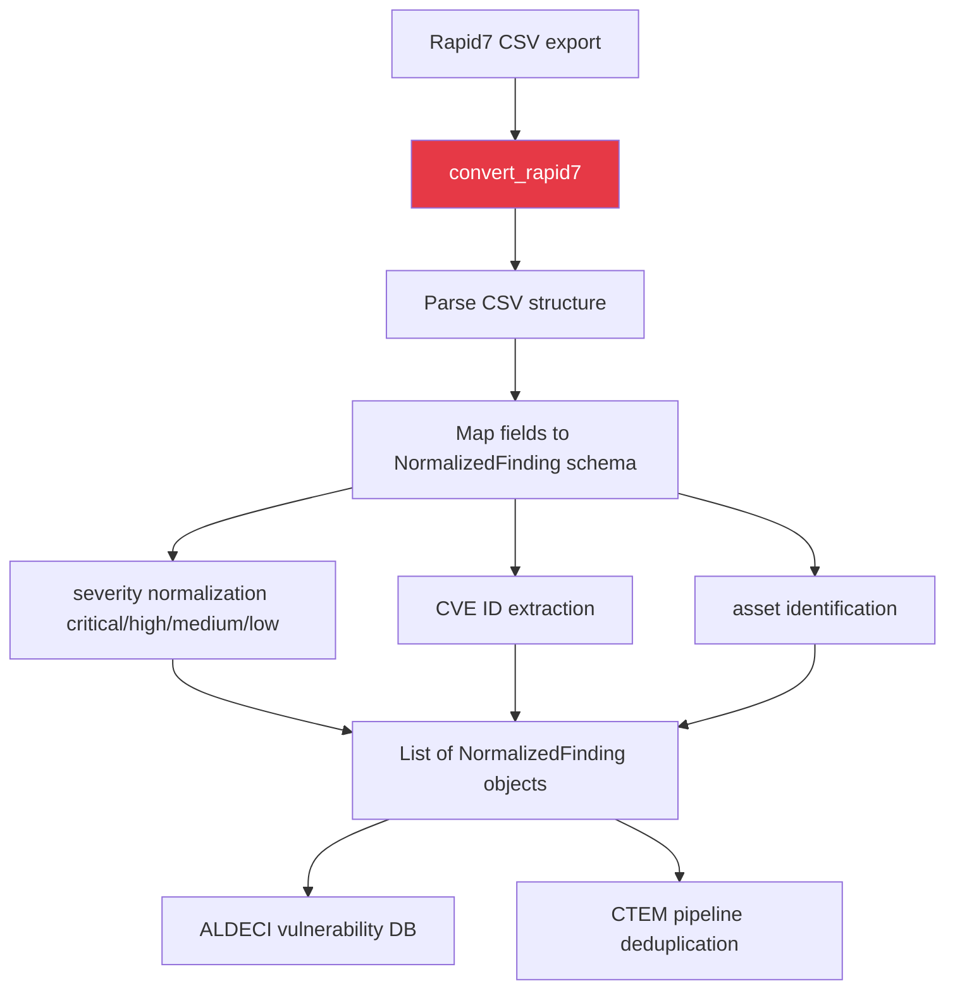

# PRD: Community 473 — multiscanner_consolidate.convert_rapid7

## Master Goal Mapping
**ALDECI Pillar**: ASPM — Multi-Scanner Normalization  
**Persona**: Security Engineer, Vulnerability Analyst  
**Business Value**: Converts Rapid7 CSV output into ALDECI's normalized finding schema, enabling unified vulnerability management across 32 scanner sources without vendor lock-in.

## Architecture Diagram


## Code Proof
**File**: `scripts/multiscanner_consolidate.py`  
Function: `convert_rapid7`  
Extracts: InsightVM vulnerability data with asset info from Rapid7 CSV export

```python
def convert_rapid7(data) -> List[NormalizedFinding]:
    findings = []
    # Parse Rapid7 CSV format
    # Map to NormalizedFinding(id, title, severity, cve_id, asset, source="rapid7")
    return findings
```

## Inter-Dependencies
- **Upstream**: Rapid7 scan output (CSV format)
- **Downstream**: ALDECI normalized findings DB, CTEM deduplication engine
- **Sibling**: Other scanner converters in `multiscanner_consolidate.py` (Communities 470-478)
- **Schema**: `NormalizedFinding` dataclass (id, title, severity, cve_id, asset, source, metadata)

## Data Flow
```
Rapid7 CSV file
  → convert_rapid7(data)
    → parse CSV structure
    → normalize severity: rapid7_severity → critical/high/medium/low
    → extract CVE IDs from description/references
    → return [NormalizedFinding(...), ...]
  → consolidate_all_scanners() merges with other scanner results
  → dedup by (cve_id, asset) → unified finding list
```

## Referenced Docs
- `scripts/multiscanner_consolidate.py`
- Rapid7 API/export documentation
- ALDECI scanner normalizers: `suite-core/core/scanner_parsers.py` (32 normalizers)

## Acceptance Criteria
- [ ] Parses valid Rapid7 CSV without error
- [ ] Maps severity to critical/high/medium/low correctly
- [ ] Extracts CVE IDs where present
- [ ] Handles missing optional fields gracefully
- [ ] Returns empty list for empty input (no exception)
- [ ] Source field set to "rapid7"

## Effort Estimate
**XS** — 1 day per converter. Most converters complete; verify schema compatibility.

## Status
**COMPLETE** — Converter implemented in multiscanner_consolidate.py.
